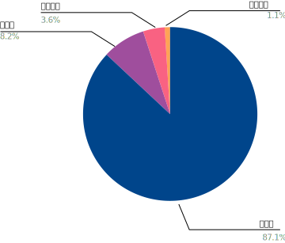
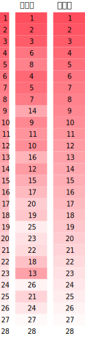
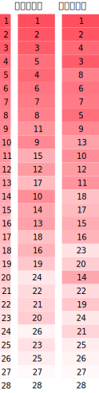

> * 原文地址：[MDN Web Developer Needs Assessment 2019](https://insights.developer.mozilla.org/reports/mdn-web-developer-needs-assessment-2019.html)
> * 原文作者：[MDN Product Advisory Board (PAB)](https://developer.mozilla.org/en-US/docs/MDN/MDN_Product_Advisory_Board/Membership)
> * 译文出自：[掘金翻译计划](https://github.com/xitu/gold-miner)
> * 本文永久链接：[https://github.com/xitu/Annual-Survey/blob/main/2019/frontend/MDN-Web-DNA-Report-2019.md](https://github.com/xitu/Annual-Survey/blob/main/2019/frontend/MDN-Web-DNA-Report-2019.md)
> * 译者：[霜羽 Hoarfroster](https://github.com/PassionPenguin)、[HumanBeing](https://github.com/HumanBeingXenon)
> * 校对者：[HumanBeing](https://github.com/HumanBeingXenon)

# 2019 年 MDN Web 开发者需求评估

## 致谢

该报告是 MDN 产品咨询委员会（PAB）的贡献所成，该委员会由以下公司组成：

* Bocoup
* Google
* Microsoft
* Mozilla
* Samsung
* W3C

我们要感谢以下人员为 MDN 开发者需求评估一文所做出的宝贵贡献：

所有的 PAB 成员：Ali Spivak、Chris Mills、Daniel Appelquist、Dominique Hazael-Massieux、Joe Medley、Jory Burson、Kadir Topal、Kyle Pflug、Meggin Kearney、Patrick Kettner、Robert Nyman 以及 Travis Leithead

PAB 以外，包括突出贡献的个人：Andreas Bovens、Andrew Overholt、Dietrich Ayala、Harald Kirschner、Harleen Batra、Marcos Caceres、Martin Balfanz、Nancy Hang、Panagiotis Astithas、Philip Jägenstedt、Rick Byers、Shi Li Li、Venetia Tay

来自 Pinpoint 的贡献者，一家进行研究并撰写本报告的机构：Allison McKeever、Dwayne King、Gabe Grayum

## 简介

你现在正在阅读的是网络上有关设计师和开发者需求的全球性年度研究报告的第一版，是一份旨在塑造网络平台的未来的报告。

在只有一个开发者的平台上，其实也只需要有一个组织去研究开发者的需求并决定将来如何实现这些需求就够了。但在网络这个平台上，要研究这些就不是那么简单的了。从浏览器厂商到研究行业标准的机构，网络这个话题需要多个组织一起参与功能决策。这导致变化可能会很慢才能产生，并意味着一些痛病之处可能需要很长时间才能解决。

在与参与标准制定和负责具体措施的落实的开发者们的讨论中，总是能够反复听到一个声音："我们需要听到更多开发者们的想法"。

这就是为什么 MDN Web 开发者需求评估渴求成为的：Web 开发者和设计师之声。

就像 Mozilla 社区一样，这份评估并非只是由我们 Mozilla 所有。这份报告也远不只是缝合各个浏览器厂商的优先事项，或是现有其他评估的一份镜像。我们的这些发现是在 MDN 产品顾问委员会的指引下得出的，并且这个调查的数据来源是由超过 30 个利益相关者委员会成员组织包括浏览器厂商、W3C 以及相关产业组织一起设计的。

如果没有来自 173 个国家的超过 28000 名开发者和设计师至少每人使用了 20 分钟完成调查，这份报告不会存在。也就是说，实际上社区贡献了超过 10000 小时的时长，帮助我们加深对 Web 开发者们对痛点、盼待与需求的理解。

受访者们贡献的数据实际上已经在改变着浏览器厂商的功能开发的优先程度，以更好的定位并处理开发者和设计师们的需求，包括 Web 上与否。通过每年制作这样一份报告，跟踪这段时间的变化的需求与痛点变的可能，让所有利益相关者看到他们在构建 Web 的明天上所付出的努力的价值。

## 调查参与者

### 受访者对象

对于这份开发者需求评估的第一代，我们关注点放在了至少花了他们一部分时间编写 Web 代码的人们（准确来说，包括了开发者和设计师们）。在目标读者之中其实偏向的是现在正与 Web 一起工作的人们。他们的声音被平台们所遗弃过，不管是因为无法满足还是别的原因，将由这份评估的未来的版本所揭晓。同样的，那些不能或并没有选择 Web 平台的人们，并不是本次研究的一部分。

### 数据来源

当这项调查最初开始的时候，我们在各个平台的 MDN 的账号上通过发推特或是 MDN 社区的其他帖子上宣传这项调查的。最开始的回应是最多样化的，受访者被分进了不同的来源渠道并打成了平局。随着时间的推移，MDN 官网上的横幅仍然挂在那里，也称为最突出的流量来源。MDN 的积极的宣传让受访者群体偏向了让那些关注使用 MDN 的人们，但毕竟 MDN 服务的是大多数的 Web 开发者和设计师群体啊，因此这份数据极其可观，也颇具研究价值。

### 实际数据

这份调查实际有 76118 名受访者填写，28474 份（37.4%）完整作答。部分作答或是低质量的作答并不包含在统计数据中。

### 调查结果

完整的调查结果被按照性别、地区、国家、开发者类型和熟悉程度被进一步在下文中被分类。

### 按照性别分类

我们这个项目最初的目标就是去获取一个更广，更能够代表全球开发者群体的一份评估报告。但即便我们尝试去获取有代表性的目标群体的数据，87.1% 的受访者是男性，8.2% 是女性，3.6% 是不愿透露的，以及 1.1% 表示两个选项都不适合自己。从这个角度来看，美国劳工统计局所估计的应该有 20% 的女性参与软件开发，尽管说我们所统计的并不一定与他们所统计的标准相同，但如果将我们的标准修改与美国政府一样，那么我们就拥有了 10.9% 的女性受访者比例。

调查数据上性别的差异也是 MDN Web DNA 报告第一代的一个缺陷，也是几乎所有的开发者调查报告的一个通病。数据上的差异，同样也导致我们处理数据的方式也有所变化。我们的方法是将女性或其他小众群体排开。我们曾经尝试通过单独分离，来在数据中呈现更多不同群体的反馈，但我们还是失败了。在我们这份报告的未来的别的版本，我们会继续尝试去针对更公平地代表开发者群体这个任务去奋斗，去减小或是尽量让偏差合理化。

我们在调查问卷中所提供的选项都经过 Mozilla 的法律团队的仔细审查。我们所提供的所有的四个选项都是有意为之，有针对性地发问的。我们在全球范围内开展了这项调查，并添加了一些需要提供个人身份信息的选择性问题。对不认同与出生时所确定的性别相一致的人的法律承认程度在世界各地差别很大。我们不希望有能将受访者置于危险境地的性别方面的数据。在收集到完成作答的问卷中，一共有 55.2% 的受访者回答了这些选择性问题

### 按照地区分类

### 按照国家分类

这份调查报告是以英语并本地化为其他八种语言，按照字母表顺序排列如下：

* Arabic 阿拉伯语
* Chinese Simplified 简体中文
* France 法语
* Japanese 日语
* Korean 韩语
* Portuguese Brazil 巴西式葡萄牙语
* Russian 俄语
* Spanish 西班牙语

这些语言也同样是 MDN 网站受众最多的语言的组合。这些翻译更多地传播，让更多人参与到这份调查问卷中，也能作为为什么印度没有那么多受访者的一份解释。

虽然说某些国家的比例看起来低于预期，这份调查报告还是收集到了来自 173 个国家的受访者的问卷，其中 9 个国家占到了 61.7% 的回答数，而其他的 163 个国家的占比都低于 3%。这九个具有最突出回答贡献的国家分别是：

* 美国 - 17.9%
* 中国 - 8.2%
* 俄罗斯 - 7.7%
* 印度 - 6.2%
* 德国 - 5.7%
* 法国 - 4.9%
* 英国 - 4.4%
* 乌克兰 - 3.6%
* 加拿大 - 3.1%

### 按开发者类型区分

我们的受访者被我们问到了：*"你觉得你是什么类型的开发者"*，并让他们能够多选回答。大多数的受访者都认为他们是全栈或是前端开发者。选择前端的开发者同样选择了另外的两个：基本上是 JavaScript 或是基本上是 CSS 和 HTML。共计 57.1% 的开发者选择了全栈，而仅仅只有 11.7% 的开发者选择了后端开发者。

### 按开发经验分类

开发经验是以成为开发者时长的年数为标准分类的，公平的包括了近年（两年以内）的开发者到经验丰富的开发者（超过十年的开发经验），分别对应的是 32.8% 和 23.4%。被选择最少的是中级有经验的开发者（6 - 9 年，15.6%）。另外，超过一半的受访者（60.9%），拥有少于 6 年的开发经验。

## 需求评估

### 什么是需求

在与大家一起分享前十个开发者需求之前，让我们先来简要地了解一下什么是一个需求，以便更好地行文。

陈述一个需求的模板是在项目开始之初进行的 14 场预演访谈中定下来的，以 Web 开发者的角度写下，大纲是：

I am a __________________ (persona) trying to __________________ (verb) but __________________ (barrier) because __________________ (cause), which makes me feel __________________ (emotional reaction).

> 我是一个 __________ （形容自己），尝试想要 __________ （动词），但因为 __________ （原因），遇到了 __________ （障碍），让我感到 __________ （感受、情绪）

将这个模板放入实例中，可以是这样的：

我是一个游客，尝试想要去另外的国家旅游，但因为签证是复杂的，而且我的口语能力很差，遇到了办理签证上的问题，让我感到非常沮丧。

当我们决定在调查中使用需求陈述时，我们借鉴了设计思维和产品开发过程中的常见做法，以获得灵感。因为它们是从开发者的角度出发编写的，我们觉得这是一种直观的阅读、解释和排名的方式。

这个项目的需求陈述集中在受挫的感受上。如果 Web 开发者在 Web 开发方面遇到挫折，浏览器厂商可能有潜在的机会来帮助解决这种挫折。

### 排序方法

我们使用了最大差异度量 (MaxDiff) 法，让受访者对总共 28 个需求的陈述进行排序。受访者则是看到了由每套四种需求陈述组成的十二套需求陈述。在每一组中，他们被要求选出一种让他们感到最不沮丧的需求和一种让他们感到最沮丧的需求。（单个需求语句可以在 12 套中出现不止一次，即重复出现）

需要注意的是，需求可能不是最不令人沮丧的，但这并不意味着它造成的挫败感最少。这可能意味着被调查者对该话题没有经验，或者在他们的工作中没有优先考虑该内容。

例如，*"使网站无障碍化"*在 28 个项目中排名第 24 位，这是相当低的。这并不意味着网站的无障碍化，没有改进的空间。我们在试点访谈中了解到，开发者和设计师并不总是能够在可访问性上花费必要的时间。正因为他们不会在无障碍化上花费时间，这个话题并不会让他们产生挫折感。如果将来开发者和设计师在无障碍化上投入更多时间，他们的挫折感可能也会改变，排名也会随之改变。

### 主题

这 28 个需求涵盖 14 个不同的主题。正如前面提到的，排名前十的主题中有四个与浏览器兼容性有关，这使得它成为排名最高的主题。排在前五名的主题还有编写文档、测试、调试和框架。

<table style="text-align: center">
	<tr>
		<td> 浏览器兼容性</td>
		<td> 编写文档</td>
		<td> 测试</td>
		<td> 调试</td>
		<td> 框架</td>
	</tr>
	<tr>
		<td> 隐私</td>
		<td> 安全性</td>
		<td> 认证</td>
		<td> 性能</td>
		<td> 大纲</td>
	</tr>
	<tr>
		<td> 设计</td>
		<td> 本地化</td>
		<td> 变化速度</td>
		<td> 无障碍性</td>
	</tr>
</table>

### 整体需求排名

第一名的是最令人沮丧的，倒数第一名的是最不令人沮丧的。

1. 被迫支持特定浏览器，如 IE11。
2. 框架和库的文档过时或不准确。
3. 被迫避开或移除不能跨浏览器使用的特性。
4. 跨浏览器测试。
5. 使设计在不同的浏览器中能保持外观样式、工作状态一致。
6. 发现在测试期间未捕获的错误。
7. 在一个代码库中支持多个框架。
8. 跟上大量新生和现有的工具或框架。
9. 遵守法律法规的前提下管理用户数据。
10. 理解并实施安全措施。
11. 与第三方集成进行身份验证。
12. 查明现有的性能问题。
13. 运行端到端测试。
14. 缺乏允许访问硬件的设备 API。
15. 过时的 HTML、CSS 和 JavaScript 文档。
16. 确定错误的根本原因。
17. Web 支持特定布局的能力。
18. 了解特定的技术有哪些浏览器支持。
19. 在样式化元素（如按钮）上实现视觉上的精确。
20. 运行前端测试。
21. 实现本地化。
22. 跟上 Web 平台的变化。
23. 实现性能优化。
24. 使网站可访问。
25. 请求用户授权使用 Web API（例如获取地理位置）。
26. 决定未来的学习方向以保持个人的技能与时俱进。
27. 找到同龄人社区。
28. 发现错误后立即修复。

### 需求排名的不同看法

上述的排名是按照所有一共 28474 份完整作答的调查数据总结而出的，一共排序了 28 条

这份数据将会在更进一步的被分析，为大家提供一份更细致的评价。当看到这些分析结论之间差距的时候，请牢牢记住，这些偏差并不能说明好坏，只是实际数据上不同呈现方式所导致的。

我们的数据会被按照以下类别继续细化：

**国家** - 显示这七个国家的原因是，他们是 MDN 网站，也就是本次活动流量最大的来源上，拥有访问者最多的国家。

**性别** - 当我们看到这些结论，我们需要记住，受访者们选择性别的比例 —— 男性 87.1%，女性 8.2%。这也很好地解释了，为什么男性的需求列表与总体的需求列表出入不大，而女性的与总体的区别比较大。同样的，这些差距并不代表好与坏，只是实际数据上不同呈现方式所导致的。

**对 Web 的满意度** - 在这次调查中，我们让受访者对 Web 作为平台和一系列工具（查看下文，图 27）使用做出评价，并使用李克特量表从最不满到最满意作出分类，包括了非常满意、满意、不满意、非常不满意。

**熟练程度（使用年数）** - 我们提供了选项 —— 两年或更少，以及十年或更多等各种选项。

**开发者的类别** - 受访者在问卷中还勾选了最能够描述他们的开发者类型，而对于前端开发者来说有两种，JavaScript 开发者和 HTML、CSS 开发者。

### 按国家分类

1. 被迫支持特定浏览器，如 IE11。
2. 框架和库的文档过时或不准确。
3. 被迫避开或移除不能跨浏览器使用的特性。
4. 跨浏览器测试。
5. 使设计在不同的浏览器中能保持外观样式、工作状态一致。
6. 发现在测试期间未捕获的错误。
7. 在一个代码库中支持多个框架。
8. 跟上大量新生和现有的工具或框架。
9. 遵守法律法规的前提下管理用户数据。
10. 理解并实施安全措施。
11. 与第三方集成进行身份验证。
12. 查明现有的性能问题。
13. 运行端到端测试。
14. 缺乏允许访问硬件的设备 API。
15. 过时的 HTML、CSS 和 JavaScript 文档。
16. 确定错误的根本原因。
17. Web 支持特定布局的能力。
18. 了解特定的技术有哪些浏览器支持。
19. 在样式化元素（如按钮）上实现视觉上的精确。
20. 运行前端测试。
21. 实现本地化。
22. 跟上 Web 平台的变化。
23. 实现性能优化。
24. 使网站可访问。
25. 请求用户授权使用 Web API（例如获取地理位置）。
26. 决定未来的学习方向以保持个人的技能与时俱进。
27. 找到同龄人社区。
28. 发现错误后立即修复。

### 按性别分类

1. 被迫支持特定浏览器，如 IE11。
2. 框架和库的文档过时或不准确。
3. 被迫避开或移除不能跨浏览器使用的特性。
4. 跨浏览器测试。
5. 使设计在不同的浏览器中能保持外观样式、工作状态一致。
6. 发现在测试期间未捕获的错误。
7. 在一个代码库中支持多个框架。
8. 跟上大量新生和现有的工具或框架。
9. 遵守法律法规的前提下管理用户数据。
10. 理解并实施安全措施。
11. 与第三方集成进行身份验证。
12. 查明现有的性能问题。
13. 运行端到端测试。
14. 缺乏允许访问硬件的设备 API。
15. 过时的 HTML、CSS 和 JavaScript 文档。
16. 确定错误的根本原因。
17. Web 支持特定布局的能力。
18. 了解特定的技术有哪些浏览器支持。
19. 在样式化元素（如按钮）上实现视觉上的精确。
20. 运行前端测试。
21. 实现本地化。
22. 跟上 Web 平台的变化。
23. 实现性能优化。
24. 使网站可访问。
25. 请求用户授权使用 Web API（例如获取地理位置）。
26. 决定未来的学习方向以保持个人的技能与时俱进。
27. 找到同龄人社区。
28. 发现错误后立即修复。

### 按满意程度分类

1. 被迫支持特定浏览器，如 IE11。
2. 框架和库的文档过时或不准确。
3. 被迫避开或移除不能跨浏览器使用的特性。
4. 跨浏览器测试。
5. 使设计在不同的浏览器中能保持外观样式、工作状态一致。
6. 发现在测试期间未捕获的错误。
7. 在一个代码库中支持多个框架。
8. 跟上大量新生和现有的工具或框架。
9. 遵守法律法规的前提下管理用户数据。
10. 理解并实施安全措施。
11. 与第三方集成进行身份验证。
12. 查明现有的性能问题。
13. 运行端到端测试。
14. 缺乏允许访问硬件的设备 API。
15. 过时的 HTML、CSS 和 JavaScript 文档。
16. 确定错误的根本原因。
17. Web 支持特定布局的能力。
18. 了解特定的技术有哪些浏览器支持。
19. 在样式化元素（如按钮）上实现视觉上的精确。
20. 运行前端测试。
21. 实现本地化。
22. 跟上 Web 平台的变化。
23. 实现性能优化。
24. 使网站可访问。
25. 请求用户授权使用 Web API（例如获取地理位置）。
26. 决定未来的学习方向以保持个人的技能与时俱进。
27. 找到同龄人社区。
28. 发现错误后立即修复。

### 按工作经验分类

1. 被迫支持特定浏览器，如 IE11。
2. 框架和库的文档过时或不准确。
3. 被迫避开或移除不能跨浏览器使用的特性。
4. 跨浏览器测试。
5. 使设计在不同的浏览器中能保持外观样式、工作状态一致。
6. 发现在测试期间未捕获的错误。
7. 在一个代码库中支持多个框架。
8. 跟上大量新生和现有的工具或框架。
9. 遵守法律法规的前提下管理用户数据。
10. 理解并实施安全措施。
11. 与第三方集成进行身份验证。
12. 查明现有的性能问题。
13. 运行端到端测试。
14. 缺乏允许访问硬件的设备 API。
15. 过时的 HTML、CSS 和 JavaScript 文档。
16. 确定错误的根本原因。
17. Web 支持特定布局的能力。
18. 了解特定的技术有哪些浏览器支持。
19. 在样式化元素（如按钮）上实现视觉上的精确。
20. 运行前端测试。
21. 实现本地化。
22. 跟上 Web 平台的变化。
23. 实现性能优化。
24. 使网站可访问。
25. 请求用户授权使用 Web API（例如获取地理位置）。
26. 决定未来的学习方向以保持个人的技能与时俱进。
27. 找到同龄人社区。
28. 发现错误后立即修复。

### 前端开发者想法

1. 被迫支持特定浏览器，如 IE11。
2. 框架和库的文档过时或不准确。
3. 被迫避开或移除不能跨浏览器使用的特性。
4. 跨浏览器测试。
5. 使设计在不同的浏览器中能保持外观样式、工作状态一致。
6. 发现在测试期间未捕获的错误。
7. 在一个代码库中支持多个框架。
8. 跟上大量新生和现有的工具或框架。
9. 遵守法律法规的前提下管理用户数据。
10. 理解并实施安全措施。
11. 与第三方集成进行身份验证。
12. 查明现有的性能问题。
13. 运行端到端测试。
14. 缺乏允许访问硬件的设备 API。
15. 过时的 HTML、CSS 和 JavaScript 文档。
16. 确定错误的根本原因。
17. Web 支持特定布局的能力。
18. 了解特定的技术有哪些浏览器支持。
19. 在样式化元素（如按钮）上实现视觉上的精确。
20. 运行前端测试。
21. 实现本地化。
22. 跟上 Web 平台的变化。
23. 实现性能优化。
24. 使网站可访问。
25. 请求用户授权使用 Web API（例如获取地理位置）。
26. 决定未来的学习方向以保持个人的技能与时俱进。
27. 找到同龄人社区。
28. 发现错误后立即修复。

### 开发者对需求列表的感受

因为开发者需求评估是准备要每年都发布一份的，我们询问了受访者这 28 个需求的列表对一个 Web 开发者来说是否是一个非常公平的结果。大多数的受访者都赞同这个列表具有代表性，21.6 % 持中性态度，意味着我们还有大量的空间去优化这份列表。

## 对于 Web 的总体满意度

通过这个项目，我们想要一种合适、恰当的方法来衡量 Web 开发者和设计人员对 Web 作为平台的满意程度。我们希望这是一个可在未来重复再现的问题，以衡量满意度随时间的变化。

我们问受访者：*"你如何评价作为一个平台和工具集使用 Web 构建你所需的内容的总体满意度？"*

从数据反映到，大多数的受访者（76.1％）对 Web 是非常满意或满意的，而 9％ 的受访者对此非常不满意或不满意。

## Web 上还缺啥？

### 综观

我们设置了一个开发性的问题：*"你想在 Web 上做些什么，但又缺少什么 Web 平台功能？"*这是一个可选问题，默认不需要作答。

我们之所以提出这个开放式问题，是因为我们不知道能够有什么答案能作为一个可能的标准答案，因此我们打算将收集到的结果在调查以后再去整理数据。

在 28474 份完整作答的调查问卷数据中，由 12359 名受访者回答了这个问题 —— 仅仅只有一般的用户回答了。开放式问题是很难进行分析的，因为我们无法确定受访者对问题的陈述方式，无法确定对其回答适用的背景。考虑到这一点，我们仔细研究了答案，并消除了偏题的答案。例如，许多回复的形式为*"不适用"*或*"没有缺失什么功能"*。删除不相关的答案后，共计尚存 9570 份作答。

从这些作答中，我们随机挑选出了 1000 份答案，对它们进行了分类。

除了令人惊讶的大量回应暗示希望让 Web 能够轻轻松松取得世界统治地位之外，开发者的需求分为 109 类。但是，在这些类别中，只有 7 个类别拥有总答案占比 3％ 或更多的答案：

* 与硬件的访问（12.4%）
* 浏览器兼容性（8.6%）
* 与文件系统的访问（4.7%）
* 性能（3.4%）
* 对 PWA 的支持（3.4%）
* 调试（3.3%）
* 与原生 API 的访问（3%）

有关 CSS 的需求的答案仅略低于 3％ 的 2.9％。大量的占比 2％ 的问题是关于避免在 Web 平台上使用 JavaScript 的答案（2.3％）和关于游戏的需求（2％）。

而对于其余的 99 个类别，每个类别所占的比重都不超过总数 1000 份回答的 2％。

因为该问题是开放式的，因此我们收到的答案列出了受访者希望在网络上实现的事情，但缺少这样做的平台功能。为了避免给受访者只作答一次与多次的权重不一，我们将第一份答复从列表中删除。在某些情况下，我们无法明白第一份作答是什么意思，或者受访者没有作答。在这些情况下，我们继续跳到列表中的下一项，直到我们删除了一分没有作答的数据或将列表中的第一个答案归类。

接下来的几段是简短的描述，除了标题以外，还进一步解释了类别，以及调查问卷中的详细内容。我们选择了最能体现该类别更深层含义的普通词汇。

### 对硬件的访问

大多数的回答都以 对硬件的访问 相似的或更简洁的形式出现。受访者们在答案中大多以 对硬件的访问 为答案。有些受访者的作答更为详细，一些其他常见的作答是 对通讯录、日历、相机等的访问。能够完美命中这分类的回答是：

* 拥有硬件的 API 的访问权限，能够以 Web 技术的编写能够部署呈现原生性能的应用程序。
* 在客户端浏览器中访问到更低级的硬件。
* 拥有对硬件更好的访问权限。我们可以更好的扫描数据，将一份扫描呈现到 `canvas` 之中，或是能够读取页面上被标记的内容。

### 浏览器兼容

这个分类的答案大多是希望能够拥有跨浏览器的统一的兼容，以及跨设备平台的。另外一个常见的需求是在浏览器之间能够拥有拥有更好的测试。CSS 和 JavaScript 则是浏览器兼容性请求中的两个最需要的部分，而能够完美命中这分类的回答是：

* 在不同浏览器能够有一样的渲染效果，因此客户们不会再抱怨字体在一个浏览器中挺棒的，但在另外一个就糟糕透了
* 将新技术当作标准，不用再担心浏览器是否支持
* 支持 IE 是下地狱一样的行为，是我们必须做的，而非我们希望做的。
* 不必担心 CSS 而在浏览器之间构建一样的体验。在 Chrome 以外写样式真是令人恼火 —— 指的是，到 IE 11 上乱的要死。

### 对文件系统的访问

访问文件系统应该可以算是对硬件的访问的一个自分类吧，但是却拥有大量的请求都写的是访问文件系统，足以自成一派了。大多数的回答都是简简单单的写着 访问文件系统，而有部分的回答则是表示用户需要给予权限，才能访问。能够完美命中这分类的回答是：

* 永久的本地存储的一个安全性和可用性解决方案。
* 直接保存文件到用户的电脑（有了权限以后）。
* 给予有限的权限让我们可以直接在浏览器中访问文件系统。虽说不可行，但如果有的话，让我们可以直接与文件系统交互。
* 直接操控系统文件（让用户可以在一个不是 Node.js 的在线 Web 应用程序中本地工作）。

### 性能

受访者们在不同的角度都提及了性能，有的希望能够通过特定的语言（大多数提及的是 JavaScript）知道用户的带宽。同样的，也将速度与原生应用程序相比较。能够完美命中这分类的回答是：

* 我非常期待更好的性能。现在大多数的工作都还是只能在后端完成，因为浏览器还是太慢了！性能真的是最重要的需要提升的一个因素。
* 看我在用着多少环境资源，作为性能的一部分。
* Web 应用程序（原生移动应用程序）的速度
* JavaScript 的性能太差了，我更希望在浏览器中使用 Python 或 Java，但这可一点都不可能啊。
* 精确判断用户当前的带宽。

### 对 PWA 的支持

归类为 对 PWA 的支持 的大多数答复是关于缺乏支持以及希望获得全面支持的愿望。并非所有浏览器厂商都为 PWA 提供相同的支持（就比如说 Safari 和 IE 11），这给开发者带来了巨量的挫败感。另一个常见的答案是在应用商店中将 PWA 作为选项。最能体现该类别更深层含义的回答是：

* 所有供应商都提供全面的 PWA 支持。我想开发一款基于 Web 视图的应用程序，能够在 Web 上公开可用并在所有平台上均受支持的应用程序。
* 希望 PWA 能够越来越好 —— 我们仍在等待在 iOS 上获得与 Android 类似的 PWA 应用程序体验。当然，现在 Firefox 也不提供 PWA 应用程序的安装。
* Web 可以完成本机所做的大部分工作，但是 We b 应用程序不像应用程序那样普遍使用，PWA 应该作为主要类别存在于主要应用程序商店中。
* 出现在应用程序市场中。

### 调试

撰写了有关调试的作答的受访者通常希望有更好的工具来使从捕获错误到解决错误的调试变得更加轻松便捷。最能体现该类别更深层含义的回答是：

* 更好地捕获和上传导致用户浏览器错误的情况。
* 更方便的调试方式。
* 在调试时修改源代码。
* 移动端调试。

### 对原生 API 的支持

被归类为对本机 API 的访问的答案类似于对硬件的访问或对文件系统的访问，因为开发者希望与设备操作系统集成，以及还有让 Web 应用程序的效果更像本机应用程序。最能体现该类别更深层含义的回答是：

* 与其他桌面应用程序进行交互。
* 系统操作系统集成。
* 使用一组扩展的平台提供的组件。
* 我希望 Web 应用程序更原生化。

## 技术

### 程序语言

作为网络的核心技术，我们希望了解使用 JavaScript、HTML、CSS 和 WebAssembly 进行开发的开发者的难点。

### JavaScript

JavaScript 的最大痛点是 缺乏浏览器 / 引擎 / 对给定语言功能的支持。不过，有 16％ 的受访者对 JavaScript 非常优秀……

### HTML

HTML 似乎是这些语言的闪亮之星，因为大约三分之一的受访者（35.3％）对该语言没有任何问题。同时，也有 31.5% 的人说，HTML 最大的痛点是缺乏对给定的功能的采用和支持。

### CSS

近一半（44％）的受访者表示，使用 CSS 的最大痛点是创建指定布局的挑战。由于 CSS 是用于设置网页样式的语言，结果也证实了，使用 CSS 很难实现所需的布局。我们可以用不同的方式解释这个数据，因此需要进一步研究。一种解释是 CSS 导致了很多开发者使用该语言创建布局时感到悲伤。另一种解释是，开发者正在尝试使用 CSS 来尽力而为以实现 Web 友好的布局而不是将其用于非 Web 设计领域。

### WASM WebAssembly

WebAssembly 是一项新技术，因此只有极少数的受访者（851 位）有足够的经验回答，占总作答数的 3%。下面的结果来自一个比 JavaScript、HTML 和 CSS 小得多的样本。大家认为，WASM 最大的痛点是缺少调试工具支持（51.4％）。

### 对新技术的包容程度

开发者在采用新技术时面临的最大障碍是跨浏览器的互通性，这与十大需求可是一致的！那十大需求中，其中四个与浏览器兼容性有关。

### 浏览器

Chrome 和 Firefox 在浏览器开发者支持方面处于领先地位，分别为 97.5％ 和 88.6％。第三名是 Safari，占 59.6％。

## 预演调查的结果

### 前十个需求的更深入挖掘

### 浏览器支持

在完整的需求列表中，浏览器兼容性是重要主题。有四条需求陈述进入了前十名：

* 1 被迫支持特定浏览器，如 IE11。

* 3 被迫避开或移除不能跨浏览器使用的特性。

* 4 跨浏览器测试。

* 5 使设计在不同的浏览器中能保持外观样式、工作状态一致。

在所有试点访谈结果中，讨论浏览器兼容性，特别是当 IE 是问题核心的时候，开发者们直接骂街。

尽管微软将用户转移到 Edge （以及即将来临的基于 Chromium 的版本）使得 IE11 的份额下降，由于它在企业、旧版业务应用，以及某些产业具有过度代表性，它继续成为了开发者心态炸裂的一大来源。用户普遍使用 IE 访问网络，这超出了网络开发者和微软的控制范围。在有些情况下，由公司的管理层敲定要支持的浏览器，无视那些被认定是用户使用非指定的浏览器的访问网页的而产生的数据。

*"我真的不能理解为什么人们依然使用 IE。 **浏览器兼容性**让我心态炸裂，特别是作为一个前端设计者。IE 真的是一个万恶之源，为什么人们要用它？"*

*"总的来说，浏览器兼容性不应该成为一个问题，并且它对于我们来说就是一个梦魇……我们有太多人在办公室里访问我们的应用，这意味着它们正运行着 IE11。这一点我毫不关心，除非我得写代码保持我的成果的一致性。真是一个让人抓耳挠腮的痛苦……太悲剧了。"*

*"**浏览器兼容性**很重要，但我觉得人们抓错重点了。任何我曾经工作过的地方的人都说，‘它必须也能在 IE11 上也能正常工作，’然后我在想，‘真的， 因为我认为它应该在便携版的 Safari 浏览器上正常运作而不是 IE11。’试着让部件在 IE 上也能正常工作真让人崩溃……它的产商都说了别用它了。"*

*"……对于我来说，最烦人的是……浏览器兼容性，比如有的东西已经足够简单到在 Edge 中不应该渲染结果不一致，但它就是。那是个大问题，尤其是**在我的行业**石化中，大多数人在技术上并不感冒……"*

*"……这严格意义来说与可访问性**不算相关**，它与浏览器兼容性更加相关。然而 Edge 。它是对 JAWS 的优化，它是对于专业人士的唯一流行的软件，对于小白用户来说糟糕透了……建议千万不要用 Edge，这会让部分用户转移或回退到旧版的 IE，这很糟糕。"*

但是，浏览器兼容性已经有所好转，至少有些人能看到隧道尽头的曙光。

*"浏览器兼容性并没有很多问题……每隔一段时间，我们都会支持 IE11，而这是我们唯一支持的旧款浏览器。甚至我们注意到，只有不到 0.5% 的用户在使用 IE11 ..."*

*"如果你考虑一下十年前**你必须得**整多少活才能保证你的网页在每个浏览器里看起来都挺好，这样看回你现在要干的活就是小菜一碟。你只需要做一点点事情，现在每个浏览器都支持足够的水平的特性。"*

虽然我们很容易就对 IE 指指点点，但所有的浏览器都有自己的怪癖，因此开发者不得不学习了解这些怪癖，并适配这些浏览器，使得经过繁琐的跨浏览器测试，他们的网页仍然能正常工作，甚至有的情况下不得不删除某个特性。

*"……实现跨浏览器兼容性，以达到一切正常工作的目的实在太难了……这需要大量测试……处理这些浏览器，这**并不是**什么很有意思的事情……"*

*"现代浏览器都应当支持 cookie 的 SameSite 属性。但事实证明，最新版本的 Safari 有个漏洞……不能兼容该特定版本的 Safari 意味着我们不能普遍使用它……这一切真令人沮丧。"*

*"你必须保证你开发的任何东西都能按照预期工作。有一些边缘情况，比如，假设我要制作一个 Web 表单 **并且它**能在 Chrome 内运行良好，但是由于某种原因，可能它在另一款浏览器中不能正常运行。那么你就会陷入尝试调试或者调查研究根本原因是什么的无底洞。有时候是因为使用了不受支持的 API 或者特性，但那又是应用的标志性功能……"*

*"我能理解要满足浏览器兼容性的需求，比如，你可以提取任何给定的项目或网站的指标，然后你可以查看被用于访问你的网站的技术或浏览器……你可以给出理由说，‘是这样，我们有很多客户使用某一款特定的浏览器，我们需要确保我们的项目**在**最佳水平。’这就是你在你的项目中实现的某些功能得以保留的原因。"*

尽管本身没有被列为需求陈述，浏览器兼容性的关键是用户体验。如果你的项目不能在你的用户所使用的各种浏览器上正常工作，那么他们可能就无法访问你们的网页，这可能对业务造成影响。

*"我认为你的受众能够享用你的产品非常重要

不论他们在使用什么设备或浏览器，他们都应该能够享用你的服务。我认为将你的产品部署覆盖到各种浏览器非常重要。"*

*"**浏览器兼容是**一个非常重要的隐含点，因为大家应该都拥有相同的体验。"*

### 编写文档

问卷调查参与者们把文档编写评为第二令人沮丧的需求：

* 2 框架和库的文档过时或不准确。

文档是如此重要，它会导致让人极度崩溃，是因为它是开发者理解事物运作方式的途径之一。它也是开发者们克服沮丧，寻求帮助的资源之一，这也是为什么开发者看到不准确或过时的文档会心态炸裂。 Documentation is so important, and hence leads to such high frustration because it is one of the things that gives developers an accurate picture of how things should work. It is also one of their go-to resources for overcoming frustration, which is why developers find inaccurate or outdated documentation so frustrating.

*"……**文档**真正地告诉你事物正确运作的方式……如果你不确定事物如何正确运作，你很难让它们正确执行，或难以找出你所做的工作中可能存在的问题。"*

*"文档是**帮助我克服挫败感的关键要素**，可能是因为……你觉得你懂，但是当你阅读完功能或者文档后，你会感觉，‘唔，其实我应该这样实现它’，而不是把它看作是一门学到的专业知识。"*

文档是开发者们讨厌框架的原因之一。开发者往往无法找到足够的信息来最理想地使用框架。

*"……没有人告诉我们使用**某个框架**的理想方式。我花了很多时间来理解如何格式化引导文件文件……我必须创建这棵树来确保它是符合理想的，并可以被多种不同设备使用。这一点正好没有人告诉我们该怎么做……这也是我钟爱 Vue.JS 的原因，他们会告诉你最理想使用方式。"*

### 调试

在需求的完整列表中，调试首次出现在第 6 点：

* 6 发现在测试期间未捕获的错误。

开发者在调试过程中遇到的挫败感更多地在于时间开支，以及一旦调试就会有问题出现的事实。尝试找出错误，以及它在浏览器中的显示方式是挫败感的另一个来源。

*"调试烦死人了……**它是**个没有尽头的流程。我可以写一百个测试样例，我可以**对它们全部**进行调试。过一会儿，一位用户来电，‘有个别东西用不了啊’，因此我不得不重头再来，然后又发现，‘好吧，**因为**某些原因，这又是个问题’，调试真让人心累啊。"*
**"Debugging is always irritating...[It’s] a never-ending process. I can have a hundred test cases, I can debug [them all]. I’ll come back, one user will call, ‘This particular thing is not working,’ so I have to go back again, and realize, ‘Okay, this is again a problem because [of] something so debugging is frustrating."**

*"**调试挫败感的程度**会很高……对于 HTML 和 CSS 来说，调试布局并不是什么难事……但是在 JavaScript 的环境中，我感觉像是在进程里由始至终都在调试，确保它能命中各种断点。如果我能命中所有的标记……对于我来说，我已经很满意了。调试应该更多地遵循运维**以及**版本控制，因为我觉得那正是各种事情同时发生的地方。"*

*"……**调试**令人沮丧的唯一原因，是当你实际上确认它在浏览器中是怎么出现的时候，达成这个目的你要找许多不同的地方。"*

*"调试就是让人心累，如果你已经在调试，说明你肯做错了什么。你不应该写到调试的地方，而应该进行测试，以免浪费时间进行调试……这很重要，因为一旦你调试，说明有异常在困扰着你。真心希望，你能在它发生前就能发现它。"*

### 框架

Web 开发者对于利益相关者来说有许多未知之处，其中之一就是,为什么他们喜欢框架 —— 那他们又喜欢什么框架呢？事实证明，开发者与框架的关系并不是单纯的爱与恨，这意味着开发者不一定喜欢框架。在调查中，框架在前十条需求中占了两条：

* 7 在同一个代码库中支持多个框架。
* 8 跟进大量新生和现存的框架。

有些（前端）开发者会嫉妒服务器端的世界，在那儿更加稳定，而且只有少量领衔框架；而在前端，开发者们感觉他们只是在尝试跟上许多现有框架而已。

*"Java 世界里的 Maven 是一个长期、稳定、普遍的工具，已经使用多年。与 Maven 相比，（前端）没有好的方法可以管理 Web 应用程序的依赖库，这很让人沮丧。"*

*"很有可能……框架正在进入成熟阶段，永久地只剩下屈指可数的框架，比如 React 和 Angular，就像服务器端框架那样稳定在大家都用的三到四个。但是现在还没有到达那个境界，并仍受到很多鞭笞和白眼……但这也让我保持斗志。"*

有些开发者尽量避免使用框架，主要原因是跟上新生和现存的框架很难。

*"……框架领域变化的节奏令人十分沮丧，因此我尽量避免使用它们。"*

*"我不是框架的忠实拥护者……我不觉得它们给你真的帮上了大忙……**框架**总是看起来比其应有的还要复杂，**但**它们被吹得有多好多好。我才不信。"*

另一方面，框架使得开发者可以重用已经被解决的方案，这提供了效率。

*"我使用‘框架’这个词来表示一组新的模块，这些模块已经过预构建以简化任务……如果你需要一系列复杂的代码块……来避免一些特定的问题，比如渲染或者处理某物，想必有人会创建出一个库使它变得更高效。"*

*"React 用起来非常舒服，Angular 非常可靠。现在你可以随心所欲地挑选。每一间大公司都做得很好，允许你做任何你想做的事情。**框架是**非常重要的，因为它的确让许多公司不必颇费周折就可以创造出一个不错的成果……这很好，但是某种程度上它不是在明面的，因为每个人都很擅长它。"*
**"React is a joy to use, Angular is a very solid one. You can pick and choose whatever you want now. Each one of the big ones, it’s really well made...allows you to do whatever you need. [Frameworks are] important because it does allow many companies to create something good with not much effort...it’s to the point where it’s nice, but it’s somewhat in the background because everybody got so good at it."**

参与者提到了使用基于浏览器的 API，Web 组件以及面向对象的 JavaScript 作为减少框架需求的潜在解决方案或方法。

*"……过去几年中，浏览器的确取得了巨大的发展……所有的这些浏览器 API 足以避免使用特定平台。我从过去的 10~15 年学到的经验是，每半年，某种框架就会被大肆宣传。人们会告诉你，‘这是他们见过的最好的东西。’半年后，又有新的东西登场了，你又不得不更换你的代码库。我见过的最可靠的项目工作了很多年，只是单纯地使用了基于浏览器的 API……我不得不使用纯浏览器、跨浏览器支持的 API……它们正常工作了很多年。"*

*"……框架试图解决由非面向对象的 JavaScript 的部件带来的问题，非面向对象的 JavaScript 是一种较旧的处理方式……我认为，如果你采用一种更加现代化的方式来进行网络开发，许多麻烦迎刃而解……我一直在琢磨 WebSocket……这只是一个共享对象，那是实现它的方法之一。**另一种方法是**通过远程方法指示。"*

*"我相信网络部件。如果**框架**将来不再像以前那样重要该多好。"*

### 隐私

在调查中被测试的需求的完整列表中，有两个与隐私相关的需求陈述。 一个进入前十名，排名第九：

* 9 遵守法律法规的前提下管理用户数据。

根据开发者居住的地区的不同，隐私被视为变得更好（通用数据保护条例，GDPR），或者更糟（澳洲协助和访问法案）。这些法律和法规对于保护开发者作为网络用户的隐私、他们如何处理工作，以及他们的职业轨迹都具有影响。当提及与隐私相关的法律和法规，人们相信维护隐私（无论是自己的还是用户的）是不包括在技术范畴之内的，这意味着政府需要介入，要求技术公司对其使用私人数据负责。但是，在某些国家和地区，可能是政府在利用数据。

*"我认为**隐私**更多地是针对**终端用户**而不是作为**开发者**的我……作为一个用户，我感觉现在安全多了，现在的隐私相比一年半以前更加安全，因为……如果你身在欧洲，通用数据保护条例将会使你的数据保存在更加合适的地方。"*

*"感觉有很多的服务和应用……故意设计成误导那些不懂技术细节的人们。我认为**隐私**超级重要，但令人沮丧的是，保护用户实在太难了，但我认为有了法规这种情况能得到改善……比如欧洲的通用数据保护条例（GDPR）。我是说，这是唯一的解决方法。技术层面的解决方案比如浏览器内的‘请勿跟踪’设置……我确信那些想要跟踪你的人**会**利用你的数据及一切。除非得到真正的监管，他们总会找到方法这么做。我不认为仅靠技术手段可以保护人们（的隐私）。"*

*"…… **GPDR** 的影响……我们必须做好工作，以确保当人们要求我们删除数据时，所有从他们那里获取的数据都被删除……这意味着删除日志中所有内容，确保从所有的数据库中删除所有相关数据……在此之前，我们已经在做这样的工作了，但是没有像现在这样大的压力……此外用户仍然不清楚他们是否有权行使该权利……"*

*"隐私……说实话这得看你在什么公司工作。在欧洲，**隐私问题**要容易得多……因为你必须列举你所做的一切事情，并且他们可以消除这一切数据。GPDR 真的是帮大忙了。"*

*"**隐私**非常重要……我们刚刚通过了协助和访问法案，对澳大利亚的（网络）安全业以及 IT 行业造成了沉重的打击……你可能会被指示对自己的程序进行修改，以便政府访问它，并且你不允许告诉任何人。这是人们心目中最重要的一点。在这里，如果我要找另外一份工作，大概有很多公司会说他们不想在澳大利亚招开发者，因为我们突然面临安全隐患。"*

除了围绕隐私的法律法规之外，试探访问也揭示出隐私是个人化的。当讨论隐私的时候，首先要注意保护自己作为网络用户的隐私，其次是隐私在其工作中的作用。当提及保护他们个人隐私以及他们用户的隐私时，开发者对此感到十分困难。人们认为维护他们的隐私，并认为隐私是他们所珍视的，因此他们也尝试维护用户的隐私安全。维护隐私伴随着对开发者可访问的功能的权衡。 Beyond the laws and regulations surrounding privacy, the pilot interviews revealed that privacy is personal. One thing top of mind when discussing privacy was protecting their privacy as a user of the Web, followed by the role of privacy in their work. When it came to protecting their own privacy and the privacy of their users, developers felt it is hard to do. There is a belief that maintaining their privacy is their right, and it is something they value, so they try to keep their users’ privacy safe too. Maintaining privacy comes with tradeoffs in terms of the features you’re able to access.

*"你问我为什么隐私很重要？因为这是我的权利啊。"*

*"当我使用网络时，我感到不适。我问我自己，‘这是否足够安全，或者说我是否必须使用隐私模式？’我不确定在多大程度上，我可以保护我在网上的信息和安全……非常重要的一点，在开发过程中我必须保持这些数据。"*

*"……在网络上保护我的隐私十分令人沮丧，但这对于**用户**来说，保障他们的隐私安全非常重要。我认为大多数开发者在他们搭建网页的时候应该考虑这一点。作为一名消费者，我认为保障我的个人隐私安全非常重要。我不想提供个人的详细信息，我也不希望收到任何基于我在网络上的活动的广告。"*

*"作为一个德国人，**隐私**对于我们来说非常重要……我认为这是最难实现的部分，通常是因为你总想着拥有各种各样很酷的功能，想使用各种各样的平台，因此很难实现隐私（保护），但是与此同时，这对于我们来说非常重要……这是最棘手的问题之一，这也是今天我为什么拿火狐浏览器而不是 Chrome 举例。"*

*"……我认为作为用户……你安装了一个应用，然后它向你索取权限。我总觉得，‘为什么它要那权限？这根本没有必要’，你也不会想阅读**隐私政策**，你就直接点了‘是’……这是个问题……你不能相信这些应用……它们可以访问你所有的数据以及所有你浏览过的网页……我很沮丧地意识到，作为一个用户，他们应该更确切地知道它将会干什么，以及不会干什么……真令人毛骨悚然。"*

### 安全性

使前十的需求完满的是安全，排名第十：

* 10 理解并实现安全措施。

我们从这个导致这个需求的试点访谈中学到了什么关于安全性方面的事情？首先，看看人们是如何定义安全性的。开发者会在定义中使用诸如身份验证和隐私之类的术语。

*"安全性意味着任何未经授权的人无权访问系统的任何部分，任何未经许可的人都无法查看系统中的数据。"*

*"**当我考虑安全性的问题时**，我会想到身份验证……如何防范恶意登录或者对本应安全的事物的恶意攻击。"*

*"……**如果**一个网站以预期方式工作着，遵守着所有的访问规则……比如你的用户知晓数据如何被处理，**以及**用户提交的数据仅被用作**其预期用途**，**这个网站**会被认为是安全的……"*

*"对于我来说，安全性就是数据的真实性，对用户进行身份验证，并确认其他试图与我交换数据的人是假冒的……信任非常重要，这样你的用户就会知道他们获取的数据是从你那里来的，他们发送的数据是交给你的。我认为身份验证是关键。"*

*"隐私是关于保障人们的数据安全，而安全性可能会带来进一步的影响，比如你的应用被攻破，或者有人破解它**因此**不再按预期执行。比如合理的密码保护以及阻止用户账号遭到入侵的手段，以及随后这些信息被用作其他用途……因此，隐私是安全性的一部分。"*

除了安全性的定义以外，我们主要听说的是 Web 开发者对安全性认识不足，这会产生一种对大神会发现并利用这些安全缺陷的担忧和挫败的感觉。特别是因为安全被看得非常重要，这种感觉会造成很大压力。

*"安全性是我确信我们应该做得更好的事情之一，我们还未遇到问题，但是需要的只是一个问题……"*

*"我总是担心有的安全问题我还没有发现。我绞尽脑汁考虑是否可能让第三方恶意软件以另一个人的身份通过验证……我还没有弄清楚**答案**，但我感觉在这个领域我还不够聪明到知晓某件事是否可行。"*

*"……**说到安全性**我一直对此感到恐惧……我在启动以后就使用 JWT 对我的请求进行身份验证。我一直怀疑它是否坚不可摧……一个优秀的黑客可能正这样做……我认为有好多事要学习，有很多步要走。我还没做到那一步。也许那就是我的无知吧。"*

*"坦白地说，安全性对于任何时候的任何客户而言都是非常重要的……你必须确保**用户**数据包含在我们之中……应用安全性非常令人沮丧，因为我本人并不擅长于安全性， 我个人认为没有足够的在线资源来真正解释为什么你的安全性可能存在缺陷，或者你做错了什么可能导致安全性缺陷。 通常来说，我不太了解安全性。"*

我们听到说实现安全的方法就像是对自身的补丁，这是网络发展的结果。随着安全性变得更重要，确保安全性的新方法已经没有必要发展，但这些是反变革的发展。

*"安全是如此重要……对于你的企业和个人来说，糟糕的安全性是灾难性的。这是目前最重要的事情之一……每隔几天就会出现漏洞，然后大量的用户数据被泄露。这太糟糕了……因为要让它恢复正常实在太难了，这十分令人沮丧。网络上有很多东西一开始就被攻破了，因为这是网络发展的方式……真的要做好很难。很多我们过去在安全方面使用的很多方法来保护比如令牌之类的东西……感觉他们就像个补丁或者盖在整个系统上的优化模块……让你的应用真正安全是不可能的，**因为**那并不存在。协议和基础库中的所有事物总会有漏洞……同时又是如此的困难和重要。"*

我们听到的第三点内容是安全性是与用户的双向关系。如果安全性出了问题，则会对用户产生负面影响。然而，虽然你能尽你所知实现最佳的安全功能，但是如果用户通过密码访问网站，你作为一个 Web 开发者，你几乎不能控制他们是否使用安全的密码。

*"安全性不可或缺……它需要太多的精力，并可令人沮丧……因为这是你不想出错的事情。这可能会让你压力倍增，因为出错对于你的用户来说将会是一件非常糟糕的事情。"*

*"……我尝试确保人们在我们的系统上**使用**更好的密码……我们为他们提供了成品服务器以及开发用服务器……‘123’是他们的密码。我必须确保他们更换掉那个强度很弱的密码，但有的时候我们不知道他们正在使用的密码，因为这是他们的密码，我不应该知道的。我们发现我们的安全性仅仅和我们用户使用的密码一样。"*

正如你所见，安全性问题就像是补丁，并和用户登录相关联，安全性与需求或者由于网络和身份验证演变的步伐而产生的挫败感及其相关。

### 对剩下的需求的更深入挖掘

### 测试

在这个项目的启动会议上，利益相关者分享了他们关于测试已知情况的想法。归纳出的几点有：自动化测试难以开启，此外存在许多不同类型的测试，比如单元测试、集成测试以及功能测试。未知的点有：开发者运行的类型、以及如何或是否会造成挫败感的测试类型。

试点访谈显示，对跟踪所有可用工具来进行适当测试，对于 Web 来说自动化测试不总是适合的方法，有些开发者对这些感到沮丧。

*"**关于测试**令人沮丧的部分是不了解进行适当测试的可用工具。"*

*"网络不是自动化测试导向的地方，因为 JavaScript，HTML 以及 CSS 之间的相互依赖性太大。我在此并没有真正看到进行自动化测试的好处……通常你会响应用户事件，然后在 UI 上进行某些更改……我认为最好由人类进行测试……而后端代码与数据库、服务器或类似的东西交互，其中的逻辑很清楚，可以使用单元测试或类似的手段轻松地进行测试……"*

*"我不会像你们认为的那样日常使用自动化测试……我希望它在服务器端和客户端两端同时运行，然后我可以交互地进行测试。并非总是能够自动化测试……如何做到自动化，以及如何检视结果的方法并不总是那样清晰……如果我能玩得转的话，那将是我喜欢的测试方式。当然，这可能令人沮丧，当事物不正常运作的时候，人总是会心累。"*

参与者对测试可能感到沮丧，因为编写某些测试可能要花费大量时间，而编写这些测试的难易程度又与开发者的测试经验有关。

*"我突然想到了几个关于**为什么做测试令人心累**的理由。前端测试做单元测试并不总是很容易。这是我的感受。我之前没有写过广泛的测试用例……我知道测试导向开发的重要性，以及我们应该为测试写代码，然后再编写应用程序，以确保程序不会失败，以及诸如此类的事情。此外，我对用自动化测试得不够多而**感到沮丧**。我总是手工测试我的代码……"*

*"在有的项目中，你可能不够时间进行单元测试，这涉及到时间因素，你没有时间先编写测试用例，然后再写失败用例，然后你要想方设法让它通过测试。我们没有那么多的时间来做这个项目，因为这个是个快速迭代的产品。"*

*"我们还进行了**比单元测试或集成测试**更难编写的系统测试，因为在考虑与浏览器的所有交互时，**有更多**的事情要考虑编写，并且要花更多的时间编写。 这就是测试不是零挫折的原因。"*

意见的确有所不同。没有时间进行测试的另一面是，相信花时间运行测试可以舒缓压力。

*"哇噻，如果你是一名开发者，**测试就是**你的工作。测试不应该感到压力，它应该成为你想做的某件事。因为你知道这一点将会在实际上减少压力。"*

开发者运行的测试类型以及他们用来测试的工具都有所不同。

*"**我进行**单元测试，但这是组件级测试。一个单独的组件同时测试 TypeScript 和 HTML ……我们曾经测试 JavaScript，而现在我们整个组件一起测试……后端开发者做后端测试。我们会运行自动的端到端测试，登录然后走完页面上的全部流程。我们使用的是 Protractor 和 Selenium。现在我们使用 Test Cafe 也做大量的手动测试。我们拥有与开发者一样多的测试人员，他们负责所有的跨浏览器测试、跨设备测试以及所有此类工作。"*

*"**我运行**尽可能多的测试。我是红绿测试的坚定拥护者，然后是确保正常工作的集成测试，接着使用 Cypress 或者 Puppeteer……也许你的质量保证人员将会使用 Selenium……你必须涵盖网站的关键路径，至少要进行端到端测试……测试的选择有太多了……你可以通过检查值来进行测试，也可以在快照测试中抽象化其他内容。只要你能够根据你的逻辑检查卷，然后检查组件的结构是否良好，你应该能够快速迭代，这样就不必过多担心会出现什么问题。 "*

*"...在测试方面，所有 Angular 测试工具都将所有异步代码平展，并神奇地使其同步，以便您可以理解它并更轻松地跟随流程。"*

### 验证

Authentication was often described as difficult and frustrating for a variety of reasons, but mainly due to the complicated nature of it and the threat that exists if you get it wrong. However, authentication can be easier if a developer is willing to divest control to a third party.

*"很难为移动端应用编写安全的 API 进行身份验证。存在有流量，但是它们非常复杂。对于用户来说并不友好，而对于开发者来说不好实现。使用密码或者类似的东西的整个验证机制应该轻松不少，特别是在移动设备上你有其他的方法进行验证……比如指纹识别或者脸部识别。我希望它能随着标准的改进提升，但是当想到让它正确执行很难，依旧让人心累。"*

*"OAuth2……是个某种复杂的东西……令我最烦恼的是登录谷歌或者脸书，尽管它们使用的是同一个应用，被使用的代码一团糟。尽管它们使用的是同一个协议，它们并不完全相同，他们真的迥乎不同……我从下载……一段运行在服务器上的推荐代码开始……尽管它们使用的是同一种协议，但直到实际操作才发现，将它们部署到我的服务器的方式以及它们的处理方式完全不同。这真的十分令人疑惑，它**本该**更简单的。"*

*"我认为整个验证和授权的概念充满着困难……你随时可能遇到那种尝试搞事情以及攻破它的人。太难了，太心累了，又太重要了。"*

*"身份验证通常来说是一场梦魇……每当出现了不透明的抽象层，随后这事就迅速演变成，‘哦，这是个加密哈希算法，’我不知道这是啥，并且坦白说，我的那些拿到了计算机科学的学士学位的老兄也搞不懂。这样一来它很快就会成为少数人的专利，大部分的人都无法涉足。那甚至无视了一个问题，‘你打算把这些信息储存为 cookie，还是储存为 JSON Web 令牌？’怎么说，这是个有着大量尖端的新兴科技。但现在趋势朝着背离 JSON Web 令牌的方向发展……"*

*"部署身份验证，如果你亲自把关那讲是一场梦魇。或者，如果你愿意放弃对一切的掌控，那这事就相当简单了，就是 Web 开发中的主题之一。"*

### 性能

性能很少作为（开发中）令人心累的罪魁祸首之一被提及，然而，开发者认为它很重要。说它重要是因为它直接影响用户使用网站的体验。性能还与广泛的可访问性联系在一起，也就是说网站应该在各种设备上都能运行。

*"性能可以影响许多用户的体验，并决定他们**是否**停留在这个网页上……当他们进入这个网页后，能够浏览到……某些信息。这是做到让用户继续访问你的网站或者应用的要点之一。"*

*"性能应该与隐私、测试、工具、可访问性一道作为首要处理的事情，是因为你希望不论在何处、连接状况如何、使用的是什么设备，你的用户都能访问你的网站。"*

*"**性能**在许多方面与可访问性紧密联系，这使得它十分重要。如果你的应用又臃肿又速度慢，会对于用全新的 MacBook 的用户造成困扰，但使用低端手机的用户会无法使用，此外还会浪费用户的带宽、下载之类的资源。所以在那个层面非常重要……"*

*"就用户体验而言，性能方面，我认为有一点非常重要，那就是确保你的应用或项目是顺着**你的用户**的思路来执行。"*

*"……网页应该快速加载，而不是让用户一直等待。"*

开发者提到性能是挫败感的来源，因为很难找到时间让网站在低功率设备上有良好的表现，或者很难确定是什么导致了性能问题。这与调查结果相吻合，在28项需求中，*"确定现有的性能问题 "*排在第12位。另一个被提及的性能问题是由于企业本身的性质造成的。在短时间内经历快速增长的企业给系统和企业带来了压力，企业必须做出调整。

*"很难找出是什么拖慢了你的应用程序。而且调试出偶然情况下是怎么或者什么影响了性能。我们必须分离各个部分，并尝试迭代地找出什么造成性能下降。"*

*"通常我不会因为性能的问题而心累，我认为不论是服务器端还是客户端都有大量的工具可以帮上忙……很多情况下，真正的困难是找到合适的时机来完成那份工作，以及确保你的应用在性能没那么好的手机上也能正常运作。"*

*"我们已经有很大进步了。六个月前，我们在性能方面做得更加糟糕。问题在于，这是个好问题，我们不断地吸引来新的**用户**。现在我们每个月新增大概 100,000 名**用户**，**但**四个月前，每月新增数字才大约 30,000。最近的三个月，我们的用户数量翻了三倍。这给我们的系统带来了沉重的负担，我们不得不在计算并行化上花大功夫。"*

开发者们提到了很多帮助他们解决性能问题的服务器端和客户端的工具。最常被提及的是网络调试工具，开发者控制台，Lighthouse，还有 New Relic 工具。

*"……我目前正在做的应用，性能太差了，我只要通过 Lighthouse 运行它，就足以说明，'嘿，它的加载时间需要 8 秒或 20 秒。我们可以做一些很明显的事情。在我之前的地方，我们超越了这一点，在那里我们需要更多的研究我们可以工作的细节，同样 Lighthouses 是我们主要使用的，因为它确实给你这样的东西的细分。还有其他的谷歌工具，我们一直在使用，我不记得名字了……我们有监控和东西，我可以看看。每天，我都会收到警告，'哦，这个应用的响应时间超过了两秒……是的，这很标准。这些都是 New Relic 驱动的。"*

*"我会进入开发者控制台，并查看‘网络’标签，观察各个东西加载的速度，加载第一页请求要往返几次……你可以通过将部件捆绑成一个文件来加载，而不是与服务器进行二十个不同的往返请求取得组装成页面的所有的部件……有很多小技巧可以加速部件加载。"*

在项目启动过程中，股东对什么表现为高性能存有疑问。 试点访谈没有得出任何统一的定论，根据开发者和他们正在从事的项目类型，高性能的标准各有不同。 开发者是根据合乎自己的工作需要这一点来定义自己的性能指标。

*"我依据负载、交互时间以及请求数量来衡量性能。当然，衡量指标需要与不同项目的规则相适应。"*

*"就我而言，我使用‘可接受的响应时间’来衡量性能……因为我主要在服务器上工作。我只看图表，尝试观察大部分的请求时间是不是在‘可接受的响应时间’之内。"*

*"当然，你总能列举出某些性能指标……有时候非常简单。如果要进行视频通话……你需要对往返时间以及每秒帧数进行严格限制。我通常会定义一个性能的度量方式，它能让我对什么是好……我试图始终以某种方式对其进行衡量。 "*

*"当我们讨论整个系统的时候，它们是性能的不同层面……从 Web 开发者的角度，我们需要确保我们用户相信……即使它花的时间比预计的更长，他们也感觉不到花了很长时间。"*

### 本地化

开发者在本地化方面遇到的挫折，已经超出了传统的考虑不同语言的视觉影响的概念，尽管这可能是挫折的来源。本地化可能意味着理解文化和这些文化中人们如何正式书写他们的名字的偏好，这样你就可以做到在设计输入字段或理解日期和时间格式偏好时考虑到这一点。如果你把这些事情弄错了，那可会导致糟糕的用户体验。本地化也被视为不仅仅是开发者的职责范围，而是开发者和设计师必须一起努力的事情。

*"我的大部分工作都是针对澳大利亚客户的，在我的上一份工作中，我们确实处理了一件与之相关的事情，那就是人们的名字和诸如每个人都有一个名字和一个姓氏的想法，他们应该按这个顺序排列，这甚至不是一点点正确的……这是一个本地化的问题，因为这些人是在澳大利亚，但他们来自其他地方。这是个问题，因为我们在做身份匹配，所以我们需要能够在不同的身份中匹配人们的名字。基本上，答案是，'如果你的名字不是标准格式，你就得去商店里处理'，这并不理想……最初设计这个系统的人都是白人，澳大利亚男性……因为一开始就建立了这种特定的方式，所以后来很难改变。

*"我今天用了一个应用，它不让我把日期改成美式格式的，所以我真的很沮丧。所以我对本地化真的很失望。那是作为一个用户……太烦人了，尤其是生活在澳大利亚。你几乎总是在使用海外的东西，如果你不能本地化，那真的会一直很明显……这超级令人沮丧，因为它就像，'我的上帝，每个人都不在你的地方'"*

*"本地化是很难做好的。这不仅仅是一个开发者的问题，而是开发者和设计人员必须共同管理的问题。它的压力很大，因为在许多组织中，人们并不真正关心它。如果你做本地化的时候一味的考虑，你的界面会看起来很糟糕，然后你必须修复它。但你一开始就没有一个让人有能力去做的用户界面，所以，你就只能浪费时间了。"*

*"本地化可能很困难，因为有时你必须将页面从右侧渲染到左侧，而不是从左到右。这涉及到几个步骤。通常情况下，如果你想用一种你不熟悉的语言来做本地化，那会有一点挫折感。例如，一个懂西班牙语的人如果懂英语和西班牙语，就可以很好地进行本地化。如果他们不懂西班牙语，如果他们必须这样做，我想可能会有一点挫折感。"*

### 变化速度

开发者们承认网络是一个变化的环境，而且往往变化很快。他们已经接受了这个现实 —— 几乎是带着一种认命的态度。

*"……我们很善于保持对事物的关注……无论发生什么，都会发生"。*

*"作为一个开发者，我想我应该接受现实，有时候现实就是这样，所以……如果环境变化相当快……不管多快多慢，我都得去适应。"*

*"趋势很重要，而我们要跟着趋势走，因为这样才能看到行业的发展方向……他们并不像我最初想象的那样令人沮丧，因为，到最后，这只是一些总是会改变的东西。它们每隔几年就会让人感到沮丧，或者不那么沮丧，因为它们会有所不同……也许你不会喜欢所有的东西，但它们甚至不是你必须严格遵循的东西。所以如果是你不太喜欢的东西，你还可以依靠别的东西。"*

*"每次当我尝试学习新的东西时，我总是觉得它比需要的更复杂，我想每个人都有这种感觉。"*

并不是所有的变化都是坏事，因为变化可以带来技术的进步和更高效的做事方式，但更新的频率太快难以跟上，以至于他们的工作也收到了影响。开发者们主要是担心随着新技术和新工具的出现，需要将工作迁移过来，而在这个过程中坏了事情。

*"……网络领域的变化速度相当快，但这在某种程度上是令人沮丧的 —— 因为你必须将你所有的项目和从一个工具迁移到另一个工具。"*

*"变化的速度是令人沮丧的，而且非常重要，特别是当涉及到更新，以及事情变化和事情中断的速度。有时你不知道如何，或为什么。要跟上时代的步伐是非常困难的，尤其是当你试图维护一套不同的应用程序时，其中一些是传统的应用程序……因为在许多情况下，这通常会让你的应用程序崩溃。"*

*"……用于 Web 开发的框架在很大程度上与做某些目前流行的、以前没有效率的任务的效率有关……比如加密，就是 MD5 校验被发现是不完美的，在某些时候，从密码学的角度来说……任何将它用于极度安全的目的的项目都需要暂停，这很有压力……这更多的是与数学的进步有关，这不是任何人的错……我担心一个现有的技术会被人为地迅速淘汰。如果它的使用形式，或者你的项目依赖于它。"*

### 无障碍

与认证类似，无障碍性，开发者也认为它是困难的和令人沮丧的。开发者了解使网站无障碍化的步骤，但有时这些步骤很难做到位，标准也有很多不足之处。通常情况下，开发者可能会遇到这样的情况：他们的组织并没有将无障碍性放在优先位置，因为，也许，它还没有成为一个问题。对这种需求的认识还不到位。在这些情况下，无障碍性被认为不如正确实现它所需的时间和精力重要。

"*无障碍性这一点非常重要……这很令人沮丧，因为要把它做好很难。我认为大多数网络开发者，包括我自己在内，都没有付出足够的努力来让我们的应用具有可访问性，因为这很难。你需要使用这些工具来模拟如何使用我们的应用，使用屏幕阅读器。工具是存在的，只是我们没有使用它们。我不认为说我对无障碍性感到沮丧是公平的，因为这只是一个要把它做好的问题。但这绝对是超级重要的，因为有很多事情当你在开发一个网络应用时，你只是假设人们会以你的方式来使用它……当你自己没有看到问题时，你就不会想到去解决它。所以，也许这种意识是一般人所缺少的？"*

*"我们的应用并不是那么容易上手。我要把无障碍的重要性放在一个较低的水平，不是因为它真的应该那么低，而是因为我们没有把它放在优先位置……我们把我们的软件卖给那些使用 `iframe` 导入我们软件的客户公司，而他们从来没有向我们提到过无障碍性。在我之前的公司，无障碍性是非常重要的，我们确保所有的东西都是无障碍的。但我现在的公司，这却一次都没有提到过。我一直在想，在某些时候，我们需要在这方面下功夫，确保我们的软件是无障碍的，但我们的客户却也没有一个人提到过。"*

*"无障碍 —— 我不想让它在项目快完工甚至已经结束项目后才被人们想起来，但这是我所在团队的副产品。我确实认识到它的重要性，但我觉得……它并没有被大家投入大量的精力去开发。"*

*"我想说，[无障碍]造成的挫折程度大于它的重要性，它是重要的。在不贬低其重要性的前提下，它是重要的，你应该能够使用网络技术，无论你是有视觉、身体还是认知障碍。目前，ARIA 和网络无障碍规范是一团糟。我们得到的无障碍性审核，彼此之间会有矛盾。它很重要，而目前实施的方式……以及对规范的解释（或不解释）和明确（或不明确）的方式只是一场噩梦。"*

### 框架大纲

一些试点访谈结果揭示了一些需求，这些需求是离群索居的，没有在调查中进行测试。我们把它们包括在这里，因为它们是一些网络开发者必须要解决的问题，而且可能会引起挫折感。

### 运维

当提到 Ops 运维时，我们通常指的是与创建构建和部署有关的任何事情。

参与试点访谈的听众认为，由于缺乏熟悉和实践，运维是一个挫折的来源。大多数参与者并不直接负责运维工作，或者他们的项目不需要那么复杂。

*"我认识到比如说运维，如果我更熟悉，或者我重复做一些事情次数足够多熟悉了它，那么我可以看到情况变糟糕的原因就是被迫投入时间来熟悉堆栈或核心技术……"*

*"我现在开始在 Heroku 上部署，我对持续集成和部署不是很熟悉。我想，也许这就是为什么会出现这样的问题……很多时候我并不了解系统。"*

*"……部署，我希望我知道的更多……我没有太多的机会与部署和持续集成工作，因此觉得这不清楚。我不知道什么是协同集群。我对 Docker 镜像有最基本的熟悉，我们也在 Docker 容器上运行了一些东西……我会说它们非常重要，至少对我工作的代码库来说是这样的……我把 "挫折感" 放在较低的位置……因为我没怎么有过。它们对我来说是不透明的，或者说是未知的。" *

*……如果你的运营很好，处理很多很多的部署不会有太大的压力。因为如果你的运营很好，部署很多……就不会有压力。这只是你要做的事情，你要做的很舒服。"*

### 工具

工具是一个广泛的主题，与 Web 开发的其他领域如调试、测试和浏览器兼容性等都有联系。开发者对工具领域的变化速度感到沮丧。很难跟上现有的东西。即使他们觉得自己的选择是最新的，决定使用哪种工具也是一件苦差事。

*"关于工具，让我感到沮丧的情况更多的是我不知道有哪些工具……"*

*"有数量惊人的工具可以使用，比如最小化图片的工具，清理代码的工具，或者修改代码的工具……有这么多工具，而且它们非常有用，但有时很难决定使用哪一个。"*

*选择工具的原因是某样东西是否被支持、是否被普遍使用、是否容易使用。后一个原因是开发者衡量一个工具好坏的方式，因为他们不想把所有的时间都花在学习如何使用一个工具上。常用的工具为开发者提供了一定程度的保证，即它很可能在未来继续得到支持*

*"……在我们开始使用任何一个开源项目之前，我们会仔细评估我们认为这是否是一个可行的、受支持的项目，否则这只会成为我们将来要处理的更多的技术债务。"*

*"我们尽量不添加大量的小的支持库，因为我们的系统中尽量不要有太多的依赖关系。这往往是我们今后出现问题的地方。比如，我们已经将某些库集成到我们的系统中，或者使用某些不再支持的工具。所以我们要么自己开始支持它们，要么放弃它们。"*

*"……在工具方面，似乎会有新的工具出现。我倾向于选择常见的工具……那才是我应该精通的工具……如果我要查找如何做某事，那就必须超越文档愿意提供的内容，因为，你会有，缺乏一个更好的术语，超级明星的网络开发，'哦，他们使用这个特定的编辑器，'如果他们使用那个，你就知道你有资源可以去找。"*

*"……工具上的挫败往往来源于提升速度和重要性的时间，因为与你接口的工具，你想花大部分时间达到终点，而不是学习工具。"*

*"如果一个框架有很多库和工具，我可以立即使用……如果它已经测试过了，如果它已经存在了一段时间，我会选择它。我会选择一个老的框架，而不是还在发展的新框架……如果有一个已经在市场上了五年以上的框架，我想那会有更多的工具，更多的测试工具，它们是经过时间测试的，但是一个还在发展的项目可能没有那个"*

开发者会尽力避免使用那些有怪癖、有 bug，或者可能无法在 Linux 上运行的工具（如果那是他们喜欢的操作系统）。

*"我已经在桌面和服务器上使用 Linux 很长时间了。我已经习惯了一些东西不能正常工作，所以让我感到沮丧的东西就是不能在 Linux 上运行的工具。"*

很明显，工具很重要，因为我每天都在使用它们。它们可能会有点令人沮丧，因为工具经常跟不上变化的速度。另外，我发现它们可能会有点不稳定，有些东西就是不能正常工作，我想这部分是因为在 JavaScript 中让东西正常工作是很难的。小问题，比如 Chrome 浏览器中的 DevTools，好久以来你都不能正确调整窗口的大小，而且似乎总是这样，我想是因为他们不卖工具……他们似乎经常崩溃。

*"浏览器中其他的 DevTools 是我最需要的东西，它们似乎有点飘忽不定……小小的用户界面问题，只是让人感到沮丧……它们肯定会变得更好，当我免费获得它们时，抱怨它们感觉很贱。浏览器厂商和其他人一样都是想赚钱的公司，浏览器也是有市场的。我想 DevTools 工具是为了鼓励开发者为他们的平台多开发一点，但还是觉得这是他们为我们做的一件好事，而不是核心的东西……如果他们想让我到他们的平台上，我可能应该期望他们这样做。"*

### 与他人协作

一些试点访谈参与者与其他人在一个团队中工作，这可能会造成挫折。这并不是 Web 开发者所特有的，但它对他们的影响是，它可以创造一个更复杂的环境来管理代码，也可以决定项目要求。还有对不同类型的开发者的看法，这也会给团队动态带来色彩。这些大多是在部署过程中产生的。

*"框架是管理层或高级开发者……支配的副产品……我与那些不愿意做出改变或尝试不同框架的开发者一起工作，因为为什么要不/不]选择某个已经测试过的东西呢？……这时你就会开始陷入繁文缛节……我在 2016 年的时候就试图推销可能迁移到 React……长话短说，由于许可的原因，这不是法律上可以接受的事情。这本身就是令人沮丧的，但我真的没有任何办法"*

*"...在公司里，大家都知道……...代码架构是需要时间的，如果你一直走得很快，有时你就不得不这样做，因为，'嘿，市场，你知道，如果你必须为你的产品做一些事情，你就必须这样做，但只要公司知道，如果你走得比你快，你就必须付出代价，然后再做一次。有了好的代码架构，压力水平可以降低很多。对于重要性你无能为力，因为到最后，它将会对你有很大的帮助……它可以减少很多调试，因为如果你能把你的逻辑分成很好的部分，你就不会混合关注。所以当有些东西不对的时候，你就会知道该去哪里找。"*

*"我更多的时候是按照团队设定的准则来做的比我单独工作时更多。通常我们的做法是有主分支，然后我们有自己开发的主题分支……为了成功地进行编码审查，你必须提交并推送到你的主题分支。一旦团队达成共识，比如，'好的，我认为我们已经准备好进入下一个版本了'，我们就会把我们所有的代码合并到新的将是主分支。"*

*"我和其他一个开发者一起管理所有这些工具，这可能会让人有点沮丧。例如，昨天，另一个开发者在我们的一个系统上升级了我们的 PHP，Jenkins 崩溃了。我们无法部署我们的任何软件……我们花了三个小时才弄清楚如何让我们的部署重新工作。"*

*"……代码质量，这一点在越多的人参与项目的情况下就越重要。架构也是一样。所有这些问题都可能从不那么重要的、低级的挫败感变成更重要的、高级的挫败感……代码质量显示了你对其他开发者的尊重，我想，因为你不是唯一一个要做某事的人。你必须确保你留下的代码能让你和其他人的生活更轻松"*

*"运维是把代码放在那里，确保它不会倒下。作为一个前端开发，这主要是别人的问题，不是因为我不想参与，而是我发现在我工作过的很多地方，都有这样一种态度，认为前端开发对运维一无所知。这很奇怪，因为它就像，"为什么你希望 Java 开发者知道他们的东西是如何部署的，而不希望我知道我的东西是如何部署的？这让我觉得很沮丧……对前端有点不尊重，这也是我离开的原因之一。"*

*"调试，我对它没有太多的基于工具的挫败感，也没有基于产品的挫败感。大多只是阅读别人的，我把半年前的我算作别人的，他们的差评面条代码。"*

### 雇佣 Web 开发者

我们听到的关于招聘的内容可以用另外两个需求声明来概括。

* 寻找具有适当技能的开发者

* 审查潜在雇员的技能

我们在试点面试中了解到，世界上不同地区有不同的技能组合。招聘经理在决定在哪里发布和刊登招聘广告时，会评估地区性的技能组合。在为开发者提供工作之前，对他们的技能进行审查是非常困难的，如果没有经过适当的审查，可能会导致一个错误的招聘决定。

*"……我们已经雇佣了三个没有成功的开发者……其中一些人……在简历上撒了谎。他们说自己擅长某些方面的技术，而他们并不擅长。正因为如此……我们对他们有不同的期望，而他们也没有很强的学习动力"*

### 基础设施建设的不同

这指的是影响业务决策的间歇性停电，例如，数据中心的位置。我们在尝试进行访谈时，亲身体验到了这种影响。其中一位参与者所处的地区正在经历间歇性停电，无法完成采访。

*早期，我们决定不部署到云端，因为我们的母公司有自己的数据中心，而数据中心位于一个乡村地区，我们遇到的问题是有时停电，有时网络中断。这是一个发展中国家，它没有北美或欧洲那样的稳定性。我们正在研究替代方案，是否应该将更多的服务转移到云端，以及如何让事情变得更稳定。

### 克服沮丧

在探讨了导致 Web 开发者感到挫折，但对他们的工作也很重要的话题之后，话题发生了转变，集中在他们用来克服这些挫折的资源上。有两种主流资源帮助开发者克服挫折。第一种是同行社区，通常是个人熟人或相隔程度不高的熟人。第二种是挖掘网上的资源。

当开发者向同行社区寻求意见时，他们通常会对与自己关系密切的其他人的技能和才能有所了解。他们呼吁人们帮助解决一个战术问题，比如排除问题，或者帮助他们做出有助于他们作为一个开发者成长的选择，比如建议他们应该投入时间去学习什么工具或框架。

*"我认为在这个领域里，你能学会如何做任何事情的最好方法似乎是有一群人自动或隐性或不费吹灰之力地让你知道那些你本来看不到的关于事物状态的消息。"*

*"在运筹学方面，我的朋友很擅长。他只是为我做了……这简直就是我通过 DevOps 问题解决的方式。我只是告诉他，'嘿，这是我的问题，你能帮忙吗？'……他只是告诉你下一步该怎么做。这是非常有用的。"*

*"有当地的开发者社区。所以这很容易……人们真的很有帮助。我只是说，'好吧，我已经做了这个，接下来我应该怎么做？你会建议我做什么？"*

*"……我们有几个人知道安全或者接受过销售和安全方面的培训，我们不断地回到他们身边……他们只是朋友"*

当开发者挖掘在线资源时，他们使用的是常见的嫌疑人（按字母顺序排列）：freeCodeCamp、GitHub。

Google、MDN、Reddit、Stack Overflow、W3Schools 和 YouTube。这些资源之所以在故障排除和克服挫折方面如此有价值，部分原因在于它们为开发者提供了进入他们在网络中培养的社区之外的渠道。这个更广泛的社区很可能经历过类似的情况，并且可以帮助解决问题，无论是通过论坛还是视频分享。这些网站还提供官方文档，这是解决问题的关键资源。

*网络是一个不可思议的资源，因为几乎总是有人和你有同样的问题……"*

*"故障诊断的主要接触点是，我如何形成谷歌搜索来获取信息？"*

*"为了克服我不知道的东西的挫折感我会直接在谷歌上找到信息或 YouTube。我发现一些常见的网站很有帮助，比如 Stack Overflow，当然还有 Mozilla，W3Schools……这些网站很容易访问，很容易找到我需要的信息，组织得很好，视觉上很有吸引力，而且很容易理解。

*"文档是帮助我克服挫折感的核心，部分原因是……你认为你知道一些东西，但在阅读了所述功能或所述文档后，你会觉得，'啊，我应该这样实现它'，而不是学习到的诀窍，可以这么说"*

### 需求是有情景的

当涉及到 Web 开发时，开发者会遇到无数的挫折，这对浏览器厂商来说，可能是解决这种挫折的机会，从而满足需求。

虽然本报告关注的是 Web 开发者的十大需求，但这些挫折比十大列表所能传达的更多细微差别，因为需求不是静态的。在任何时候，Web 开发者都可能处于影响他们觉得沮丧的情况，为什么会沮丧，以及如何导致沮丧。从试点访谈中，主要出现了四种情况。

* 作为广大网络开发社区的一员。

* 在没有外部利益相关者的情况下，为自己的项目工作。

* 从事有需求的项目。

* 适应在一个组织内或作为团队的一部分协同工作。

让我们考虑一些例子。首先，我们知道十大需求之一是，"跟上大量新的和现有的工具或框架"。为什么会有这种挫折感以及如何挫折，在不同的情况下会有不同的体验。

**在没有外部利益相关者的情况下，**为自己的项目工作。

*"当我为自己写代码时，我经常做一些简单的事情，所以我不需要框架，但更多的是，我喜欢了解东西的实际工作原理，而框架隐藏了实现细节。"*

**适应在一个组织内或作为团队的一部分团结工作。**

*"当我去工作时，我们使用 Angular，它很好。如果我在其他使用不同框架的地方工作，我将不得不适应并学习新框架。这是管理的副产品。"*

*或高级开发者的支配。我与那些不愿意做出改变或尝试不同框架的开发者合作。他们的偏好是坚持使用一些经过测试的东西，或者已经被法律认可的东西。例如，团队谈到使用 jQuery 来构建一个 Web 应用。我们可以这么做，但为了效率，Angular 或 React 会更好。法律部门介入了，由于担心授权问题，不让我们使用 React。我们坚持使用 jQuery"*

**成为广大 Web 开发社区的一员：**

*"我有一个 web 开发者的社区。我们都有不同的观点，什么是当下流行的，什么是值得学习或不值得学习的。有一个朋友鼓励我不要学 Node JS，因为他觉得太特殊了。但是，我也看过很多次，说它很有用，是个好东西，值得学习。Angular 是另一个例子，半年前我甚至不知道它的存在，我已经得到了关于是否值得花时间学习的竞争性意见。"*

开发者所从事的项目类型会因为项目的要求而产生或消除挫折感。

*"我们的软件只使用我们从第三方收到的匿名数据，所以隐私对我们来说不是很沮丧。"我们实际上没有任何身份识别数据"*

*"如果我的东西在 Chrome 浏览器中运行良好，我就很高兴了。我并不是...想针对老版本的 Internet Explorer 或者类似的东西。所以我并不太关心浏览器的兼容性。但这很重要，我希望这对雇佣我开发东西的人来说很重要"*

*"我还没有制作出真正有市场的东西……我做这些东西很多是为了自娱自乐。我只是在玩，所以这对我来说不是问题。我认识到它的重要性，但我还没有……...还没有处理过它。"*

*"好吧，我想到了可用的工具，你可以……我想到的是像开发运营，我并不真的需要。所以我不知道这是否真的适用于我那里。因为我做的事情不够复杂，不需要，比如任何部署，到，你知道，多个地方，或者任何真正的整合，外部资源。所以，我想我要离开这个问题了。"*

*"我基本上是想运行一个 web 服务器，托管一些 HTML，JavaScript，CSS，并把这个提供给我的客户。所以只是保持一个单一的 Web 服务器的运行。这比拥有一个复杂的微服务框架来驱动我的应用程序要容易得多。"*

### 更广的看法

### 外在

网络的发展导致了这样一种状态：开发者可以为服务付费，比如托管，这就减少了拥有和维护所有基础设施的需要，而这些基础设施在以前是需要把东西放到网上的。然而，你不拥有的每一块都会对工作以外的人或物产生依赖性。依赖性带来了风险，开发者必须决定这种权衡是否值得。虽然好的一面是，为网络制作东西更快、更容易，但人们担心他们的工作可能会变得过时，如果他们外部依赖的人发生了什么事情。

*"……拥有整个频谱是过分的，它只是确保这些取舍要么是你可以控制你使用的副本的东西，要么是你支付的服务，你可以把你的钱带到其他地方。"*

*"除非你从 HTML、CSS、JavaScript 入手，编写自己的 Ajax 请求，利用浏览器对象模型的广度、XML HTTP 请求 API 来回拍摄代码……否则你总是会放弃对代码的一些控制……在导入代码依赖性方面，这就是做生意的成本。它只是让编写人类可用的应用程序快了很多。但是托管的行为也在遵循同样的路径……托管的系统也被抽象掉了，交给了第三方。每周都有恐怖的故事，有人的业务就这样被卡住了……多年的工作都没了，因为他们把所有的东西都构建到了谷歌云平台上，而他们雇佣的一个开发者对他们的业务应用进行了一些调整，但他使用的是一个被列入黑名单的 Gmail 账号。也正因为如此，应用认证都被撤销了....，这是一个巨大的外部性，你必须考虑……我们托管在 Heroku 上，我们在 AWS 上也有东西，如果偶然 X 服 供应商消失了，你们公司也会消失吗？就像，如果亚马逊明天就被外星人带走了，我们的公司就不存在了……我们有备份，我们可以另起炉灶，但会有一个星期到两个星期的时间，我们会把所有的东西都建立起来，以备不时之需。"*

*"……我的兄弟觉得他受制于浏览器的创造者……他担心的是，在某些时候，他的工作所依赖的东西会因为谷歌的一个决定……或者微软的一个决定而被淘汰……事情进展得很快，这有点可怕……我对变化感到担忧的是……是更新必须基于第三方的原因进行，比如浏览器的创造者。 ……你没有那么多的控制权，比如，你使用的编译器的版本，它是静态的……我指的是人们曾经严重依赖的技术的过时……很难预测哪种现有的技术……最终会被发现一个缺陷，并有大量的工作要做，以转移到其他的东西。"*

### 浏览器的重生

开发者们已经注意到，浏览器正在变得越来越好，Internet Explorer（IE）是个例外。开发者们意识到，这不仅仅是浏览器厂商为了方便开发者的生活而做出的善意举动，他们明白浏览器对于其创造者来说，在金钱上的重要性已经增加了。

*"浏览器变得更好是因为行业开始关注……十年前……市场的竞争并不激烈 浏览器实际上并没有……除了 Firefox 之外，还在努力做好其他的事情..."*

*"浏览器作为二等或三等公民的地位已经存在了很久。现在……...谷歌正在推动它，因为他们靠广告生存，所以他们需要浏览器来做任何事情。微软回过头来开始做自己的浏览器，其实也不错，但可能他们花了太多的时间去适应，现在他们不得不改变，因为 Edge 并不像它应该做的那么好。Mozilla，嗯，Firefox 自从他们改成了 Quantum 之后，它的……它之前并没有得到太多的喜爱……即使是苹果现在也在网络上做着不错的事情，即使他们是按照自己的节奏在做，有自己的原因，但那是苹果，你不能期望太高……"*

浏览器更好是好事，但浏览器的整合让一些人担忧。首先担心的是浏览器厂商之间缺乏竞争，导致技术缺乏进步。整合对兼容性也有影响，这表现在不同的方面。

一种观点认为，由于每个浏览器厂商都试图超越其他厂商，这些进步将产生差异，可能导致兼容性降低。不过，这是为了进步，所以持这种观点的开发者可以接受。

反过来说，一些开发者认为竞争会创造出更多的兼容浏览器，因为每个浏览器都会试图至少匹配另一个浏览器所能做到的事情。但是，随着竞争的减少，兼容性可能也会减少。微软采用 Chromium 的决定被认为是减少了竞争，让 Chromium 拥有更大的市场份额。人们担心其他浏览器厂商将更难与 Chromium 竞争。市场份额较少的浏览器可能不会投入那么多资金让自己的浏览器变得更好，从而导致浏览器过时，造成兼容性问题。

*浏览器的兼容性……可能会失去重要性，因为浏览器变得越来越好……我们走得越远，我考虑的时间就越少，因为我知道每个人都在竞争……现在微软决定停止开发他们的引擎，我担心 Chromium 会获得太多的市场份额，这对浏览器的兼容性没有任何帮助"*

*"作为设计师，我认为【人们转向 Chromium 是】一件好事……但作为一个对技术的进一步发展感兴趣的人，这不是最好的事情，因为考虑到大家都会开始使用 Chromium，就不会再有竞争了。如果没有竞争，发展的速度……就会降低……总应该有一些竞争。我想微软宣布他们也要转向 Chromium，所以如果他们这样做，竞争就会减少，Mozilla 很难用他们的引擎维持下去。从用户或者是开发者的角度来说，这是一件好事，但是从浏览器的那一套特殊的技术发展或者是浏览器的发展来说，这是一件不好的事情。"*

*"……我很希望看到 Mozilla 和 Chrome 互相竞争来改进网络，我看到这两家基本上都在努力改进标准，我非常喜欢这样的做法，因为已经没有固定的标准了。"*

### 明白原理

Web 开发者了解 Web，周围的生态系统也在不断变化。随之而来的是优点和缺点。考虑到，在大多数情况下，这是他们的生计；有一个强烈的愿望，以保持一些控制和理解他们的工作。开发者做到这一点的一种方式就是投入时间去了解事物的工作原理--超越框架等现代便利的抽象概念。理解基础知识可以增强开发者的信心，当问题出现时，他们可以处理一些事情。

*"我认为[框架]并不是那么重要，因为关于事物如何工作的基础知识比具体的框架更重要，[但对于一般的网络和其他开发者来说……它们允许为网络做更多的事情。"*

*"编程的基础知识真的很重要，因为……他们可以为网络做更多的事情。 你会用基础知识，即使是[作为一个]资深人士……真的很容易犯基础错误……需要大量的时间来建立基础编程知识的逻辑。"*

*"如果我是为自己写代码，我一般不会使用框架。我只是硬着头皮去做……[所以]我知道它是如何工作的，然后当我去框架中使用它时，我就会明白框架在做什么。而我认为很多人来到前端，他们学习了框架，却不知道下面的 JavaScript 是怎么回事，这可能会让你在 80%的时间里，但当一些可怕的事情发生时，就会觉得，'为什么会这样？这是神奇的。我也是这样，我跳进 Angular，我想，'不，这太神奇了。我需要知道到底发生了什么。"*

*"……在掩盖实际发生的事情方面……经常，你不需要知道说，'哦，在 React 的土地上，我把这个状态属性作为一个道具传给这个子组件，'这就足够了，但实际上在引擎盖下面发生了什么……当需要进行挖掘的时候，如果你把所有的时间都花在框架土地上，那可能真的不清楚，很乱……"*

*"如果我学会了基本的 JavaScript 这样的东西，那么我认为我可以切换到不同的框架。"*

### 经验丰富的开发者认识到改进

本报告的大部分重点是开发者的需求和导致挫折的原因。这些挫折在多年的经验中具有代表性，从初学者（不到一年）到经验丰富的人（十年或更长时间）。属于或接近于老练阵营的开发者认识到，与他们刚开始工作时相比，网络上的东西已经更好了。改进的范围包括工具、部署、调试、布局、隐私、ES6 等。

*我认为与多年前相比，我们现在有非常好的工具来进行网络开发。现在的工具，我的意思是，它们总是可以变得更好，但似乎我们有真正的好工具，在 8-10 年前还不那么常见。"*

*"测试对于确保事情按照预期工作是非常重要的。现在有一大堆非常棒的工具可以帮助我们，我觉得这些工具超级有用……以前是超级令人沮丧，但现在的工具越来越好了"*

*"部署真的很重要，很明显，因为你需要能够把你的应用程序放在那里，但它也变得如此简单。现在我们有 Heroku 这样的服务，只需点击两下，你就可以部署你的应用，就像变魔术一样。我记得在我第一年的时候，我们有我们的部署和构建脚本，它们是用 Bash 写的..."*

*"新的 Grid 和 Flexbox 非常棒。尤其是 Firefox，对调试这些布局和查看它们的工作情况有非常惊人的支持……网格检查器，它非常好，非常有帮助，因为你可以实际看到发生了什么。就像，"这是网格的位置，这是差距的位置，这就是为什么那个网格在那里。" 他们已经有了 Flexbox 检查器，它非常好，非常有帮助，因为你可以实际看到发生了什么。他们也有 Flexbox 检查器。这就像，'为什么我的东西都在左边？哦，因为这是正在设置的，这个空间是空隙，或者这个空间其实是一个元素，原来比我想象的要大得多'。让工作中的人转向这种做事方式，而不是浮动的左边，这很有趣。"*

*"当函数刚出来的时候，它们在开发工具中是不可能调试的，因为，我不知道发生了什么，实在是太难了。而现在，调试工具已经变得更好了，做这种事情也更容易了。随着 JavaScript 越来越多的异步调试，变得非常困难。现在它又变得容易了，所以这很好……开发工具中的那些工具对调试的帮助是惊人的。"*

*"我认为有很好的调试工具……我使用 Chrome 中的调试器，主要用于 JavaScript。对于服务器端开发，我使用 Ruby 调试器。我也使用日志。而只是在一般情况下，Chrome 中的 web 控制台也是如此，还有网络标签。所有的开发者工具，它们对他们的调试都有很大的帮助。"*

"*"我认为布局的痛点已经少了很多。过去布局比较困难，设计这些巨大的表格，必须实现一定的布局……我觉得性能有了很大的提高，我觉得工具也有了很大的改进。我觉得变化的速度也比以往任何时候都要高，我觉得过去调试比较难。我觉得这些工具都有很大的改进。"*

*"Firefox 或 Safari 实现了一个非常好的 Do Not Track 引擎。Safari 不会让我知道你到底用的是哪台 MacBook，它只是会看起来像一台通用的 MacBook。他们确实有特殊的方法来改变跟踪 cookie，所以它不会总是一样的，这也是他们刚刚改进的地方。现在 Safari 和 Firefox 使用了限制模式，所以如果用户愿意，你可以防止别人跟踪你的行为。我认为我们在隐私方面会有更好的发展，我只是对它持乐观态度。"*

*"我以前对框架比较沮丧，压力很大，因为框架太多了，而且变化很大，但我现在已经不*沮丧了。自从 JavaScript ES6 之后，所有的东西都成了标准，我觉得使用 vanilla JavaScript 比以前好用多了。而且我觉得使用一个特定的框架，了解一个特定的框架并不像过去那么关键。"*

请记住，虽然人们对随着时间的推移事情变得更好的情况表示认可和赞赏，但这并不意味着事情是完美的。一些改进是导致当前环境的原因，在决定将多少控制权剥离到外部、第三方产品和服务时，开发者面临着权衡。这和变化的速度可能是压倒性的。

### Web 的缺失

同样一群经验丰富的开发者对目前网络中缺少的东西有想法。这些内容与调查结果中捕捉到的内容类似，在此列出是为了提供更多上下文的逐字记录。除了缺失的东西，这组人还对改进的机会有想法。

网络组件和隐私可以得到更好的执行。

*网络组件有一个很好的机会，但他们浪费了太多的时间……就所做的选择而言，并没有得到回报，比如 HTML 导入。他们不是最好的方法，因为所有的事情他们都不允许有好的优化。"*

*"我认为如何克服隐私上的挫折是 100 万美元的问题，对吧？因为我不认为这个东西目前没有好的解决方案……"*

对硬件的访问是网络所缺少的东西，还有推送通知和无服务器通信。

*"硬件访问……更多的设备 API 会有帮助。当然，我认为，推送通知也是一个非常重要的方面。所以，如果这两个方面能更可靠地工作，或者说能得到更好的支持，我想我会很有帮助"*

*"这是一个计算机科学工作者的非常个人的观点……更多的是基于事件的浏览器到浏览器的模式，就像在网络 RTC 环境中一样。如果我可以把任何东西放在清单上，我会说，浏览器到浏览器的通信，无服务器通信应用。这是我希望在未来看到的东西，这样基本上你就不需要网络服务器，只需要像 web RTC 那样把两个人联系在一起就可以了。"*

### Web 的未来

这些经验丰富的开发者不仅认识到网络中已经改进、仍可改进或完全缺失的领域，他们还对网络的未来有一些想法要分享。

当谈到 Web 的未来时，这些经验丰富的开发者为之兴奋。

* WebAssembly
* 渐进式网络应用
* WebAuthn
* 语音转文字

*"WebAssembly 将改变网络。这个家伙的重要性是一个疯狂的级别。它将改变 Web 从一个主要是消费的轻编辑环境，变成一个功能齐全的编辑环境。它提供的速度的提升，对网络来说是闻所未闻的"*

*"我认为，如果你让 Web 应用更像原生应用，那么你基本上可以用 Web 页面来代替很多原生应用，这就为 Web 开发者提供了一个简单的部署模式和开发模式。"*

**" 我刚刚看到，现在，他们终于决定了 WebAuthn 的规范。所以，一旦浏览器真的要实现它，对用户来说，认证将变得更加容易和安全……这可能是我对未来更好的希望。"*

*"我希望看到更多的是文本到语音和语音到文本……我认为这是网络未来的一个非常重要的话题……我不知道几年后，我们是否还会使用图形用户界面来进行交互……而我认为，网络应用也应该能够无头无尾的运行，而不需要或者不需要被迫有一个用户界面，图形用户界面作为他们面向用户的主要界面。我认为语音是应该得到更多关注的东西……"*

虽然有值得期待的地方，但也有一种担忧，不知道这种担忧有多广泛。担心的是，下一代的网络开发者可能看不到学习计算机科学基础的重要性，因为只用例子来运行是如此简单。

*"作为老师，我最难的工作我想是……去说服我的学生不要去 W3schools.com 这类网站，并只是做一个由例子驱动的 Web 开发者（有问题再去找解决思路）。我的学生通常认为他们可以在谷歌上找到所有的解决方案，而我则试图向他们解释，他们应该在做某事之前先动脑筋。我想他们会告诉我，网络是复制粘贴的地方（笑）。他们会把这些计算机科学的理论规则啊什么都扔掉，只是试图从现有的项目中复制。"*

## 结论

感谢所有组织以及完成调查的 28474 人，以及完成了部分调查的受访者们，帮助我们一起构成了开发者需求评估的第一版，而且，尤其感谢的是十四次访谈预演的受访者，没有他们的共同参与，调查就不可能进行下去～。

这项研究为参与者提供了一个机会来影响 Mozilla、Google、Microsoft、Samsung 和 W3C 等组织考虑功能开发和标准的优先程度。

开发者需求评估的第一版以有价值的信息作为结尾，让组织可以使用这些有价值的信息为在 Web 上工作的开发者和设计人员创造更好的体验。由于这是首次进行研究，因此该发现对工作背后的组织来说是全新的。我们仍在评估如何最好地利用结果来影响功能开发和标准。我们真的非常高兴分享组织为改善开发者和设计师在网络上工作的经验而采取的初步行动。

**谷歌**

*"谷歌网络平台团队现在使用开发者满意度（DSAT）作为我们最高级别的成功指标之一。我们很高兴能够使用 MDN DNA 作为主要数据来源之一，以帮助我们了解和优先处理开发者沮丧的关键领域。"*

**- Rick Byers，Blink 工程总监，网络平台团队**。

*"谷歌一直在与英特尔等其他 Chromium 贡献者合作，将硬件功能的访问引入网络，从摄像头和传感器到游戏手柄、USB 和蓝牙 API。我们相信，用户想要通过设备完成的任何任务都应该可以通过网络来实现，因此正在继续制定网络标准，以**暴露更多的传感器、Serial、HID、NFC 等。"**。

**- Joshua Bell，网络平台团队技术负责人/经理**。

**W3C**

*"这项调查的早期报告为 W3C 大型年会 (TPAC) 上多次标准化以及标准化前讨论提供了宝贵的信息。我们预计已发布的报告将继续支持标准的进程。"*

**- Wendy Seltzer, 战略主管**

**Mozilla**

*"在火狐团队中，我们始终听取我们社区的需求，以便做出产品决策。因此对于开发者社区需求的的全面概述对于我们来说绝对必要，它由 MDN DNA 报告提供，我们已经将它的调查结果融合进我们的计划。"*

**- Panagiotis Astithas, 高级工程经理, 火狐开发者体验**

除了个人组织的行为以及互操作性是 Web 开发者的主要痛点，主要的浏览器供应商正在合作开发跨浏览器测试套件，例如 Web 平台测试和 Test262。从事网络平台测试的小组已将 2020 年作为优先事项，以识别和修复最重要的测试失败并提高测试套件的质量。

## 调查和整理方法

考虑到预演的访谈给我们了一个由表及里的视角，构造我们的第一代的 DNA 调查报告，我们想提供一个关于我们如何在各个方面进行访谈的方法的文章。

**预演访谈**

为了确保受访者的是广泛的，项目相关者创建了筛选标准，帮助我们将不同的观点按照来自的国家或是性别等各种标准分离。我们在 MDN 官网上选好窜了这次调查，并且有选择地在完整作答的回答中进行了一次预演，确保我们达到了筛选标准。

那些达到标准的受访者都被我们邀请参加了我们平均一个小时长的远程采访。叙事的方法被我们采用，让人们以故事的形式，讲述他们感官中的开发世界。叙事的分析也让我们参与者更好地解释意义和真相 —— 更好地从他们的角度解释。

一个有导向性但又是开放的讨论也被采用，鼓励我们的受访者们以保持舒适且以一种聊天的氛围，贯穿整个调查的过程。语言、语调以及主题是完全由参与者决定的，也用于解释它们的陈述、动作。

为了更精准地认知受访者对于 Web 开发和设计的一个主题的感受，我们提供了一个 X - Y 轴坐标系，X 坐标轴表示受访者认为的重要性，而 Y 轴代表他们对他们所感兴趣的主题的沮丧感。

受访者们同样被我们给予一套卡片，每张卡片分别对应 Web 开发或设计的一个部分。我们让他们按照他们自己的想法，将卡片放置在坐标系中。这些部分是在调查之初就定下来的：

* Accessibility 无障碍化
* Authentication on Mobile 移动端验证
* Browser Compatibility 浏览器兼容
* Debugging 调试
* Deployment 部署
* Frameworks 框架
* Layout 布局
* Localization 本地化
* Mobile Payments 移动端支付
* Ops 运维
* Pace of change 变化的速度
* Performance 性能
* Privacy 隐私
* Security 安全
* Testing 测试
* Tools 工具
* Trends 趋势

研究人员观察受访者把卡片放在坐标系中，询问了他们把卡片放在特定的位置的原因以及卡片之间的关系。他们研究了对话语境中的语言线索，引导讨论指向受访者认为特别相关、有意义或难忘的经历。

如果受访者不明白一张卡片的意思，他们会被询问他们对于这张卡片所代表内容的理解。如果没能有具体的描述，他们会被要求把卡片移除坐标系中。在活动结束时，受访者可以创建代表所提供列表中没有的部分的卡片。指示它们以与预先提供的部分相同的方式将新定义的部分放置在网格上。

如果受访者允许，我们的采访都被录制，并拍摄了每一个创建的工件。

**分析**

在访谈之后，Pinpoint 开始了他们的分析 —— 从对转录的访谈进行详细的编码开始。他们会通读每一份采访记录来回顾叙述 —— 参与者选择谈论什么？有趣的是什么？他们是如何构造事物的？他们的语言有什么独特之处？他们希望别人怎么看待他们？

在编码数据过后，Pinpoint 开始由信息筛选转变为创建一个叙述，突出证据（他们从访谈中看到和听到的），确定见解（证据意味着什么），因为这有助于挖掘关键主题（证据为什么重要）。

**调查的创建**

对试点访谈结果的初步分析告知了调查的问题，最重要的是需求列表。最初的需求列表包括了 18 个类别中的 59 种需求陈述。这份列表最后被缩减为调查中测试的 28 种需求。MDN 产品咨询委员会（PAB）员以及 PAB 组织内的其他员工一起参与了权衡减少需求列表的过程。一个更短的需求列表可是很重要的，不然完成调查的时间会太长而且参与调查的受访者也会变少。

当一份调查草案准备好了，我们将通过用户测试和从 MDN 招募的受访者的个人访谈开始调查问卷的试点。这些试点工作是一个从我们的目标受众的角度收集早期反馈的机会，以帮助确保问题按照我们的意图得到解释。

调查问题定稿后，我们将问卷从英语本地化为其他八种语言，分别是：

* Arabic 阿拉伯语
* Chinese (simplified) 简体中文
* French 法语
* Japanese 日语
* Korean 韩语
* Portuguese (Brazil) 巴西式葡萄牙语
* Russian 俄语
* Spanish 西班牙语

调查问卷在 2019 的七月中开启，在 2019 的八月关闭。

> 如果发现译文存在错误或其他需要改进的地方，欢迎到 [掘金翻译计划](https://github.com/xitu/gold-miner) [年度报告分区](https://github.com/xitu/Annual-Survey) 对译文进行修改并 PR，也可获得相应奖励积分。文章开头的 **本文永久链接** 即为本文在 GitHub 上的 MarkDown 链接。

---

> [掘金翻译计划](https://github.com/xitu/gold-miner) 是一个翻译优质互联网技术文章的社区，文章来源为 [掘金](https://juejin.im) 上的英文分享文章。内容覆盖 [Android](https://github.com/xitu/gold-miner#android)、[iOS](https://github.com/xitu/gold-miner#ios)、[前端](https://github.com/xitu/gold-miner#前端)、[后端](https://github.com/xitu/gold-miner#后端)、[区块链](https://github.com/xitu/gold-miner#区块链)、[产品](https://github.com/xitu/gold-miner#产品)、[设计](https://github.com/xitu/gold-miner#设计)、[人工智能](https://github.com/xitu/gold-miner#人工智能)等领域，想要查看更多优质译文请持续关注 [掘金翻译计划](https://github.com/xitu/gold-miner)、[官方微博](http://weibo.com/juejinfanyi)、[知乎专栏](https://zhuanlan.zhihu.com/juejinfanyi)。
