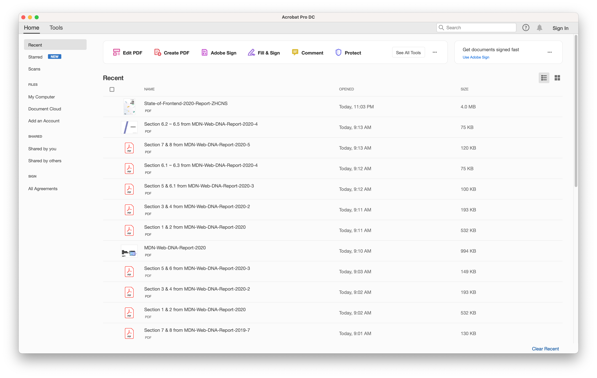
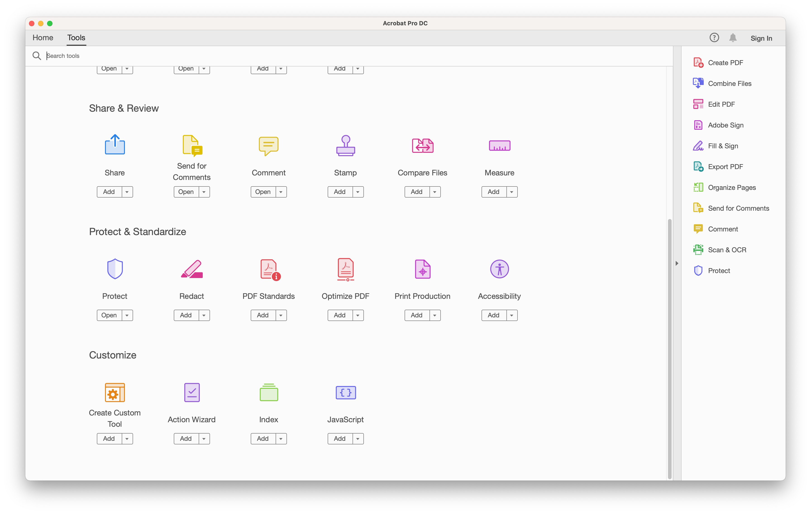
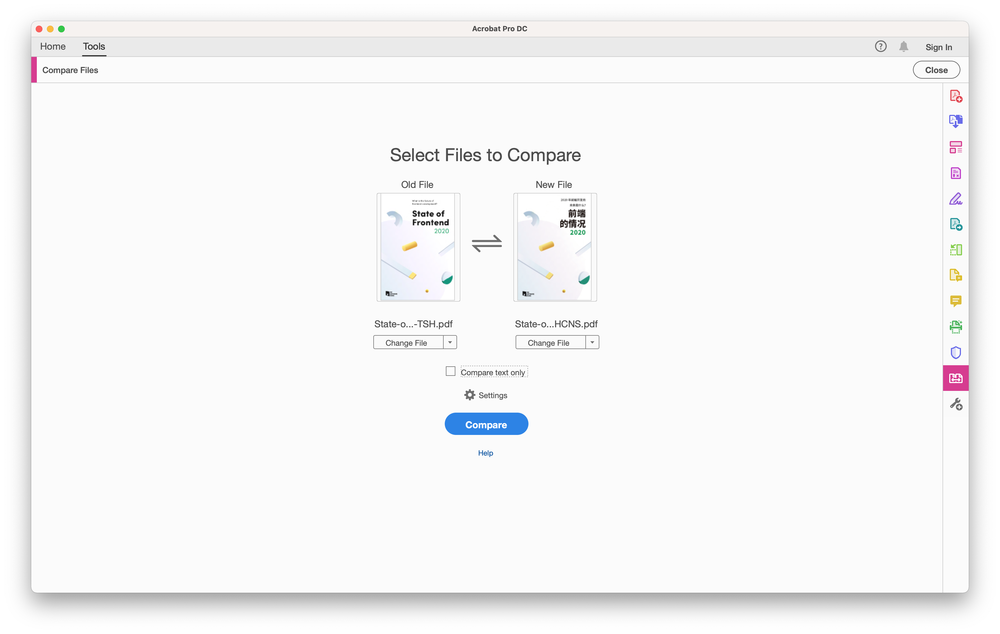
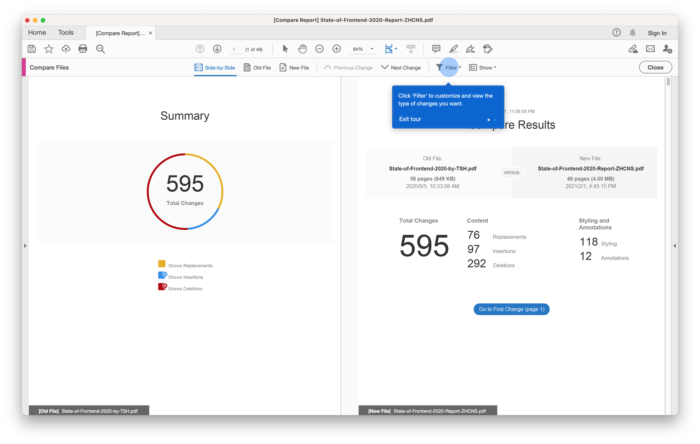
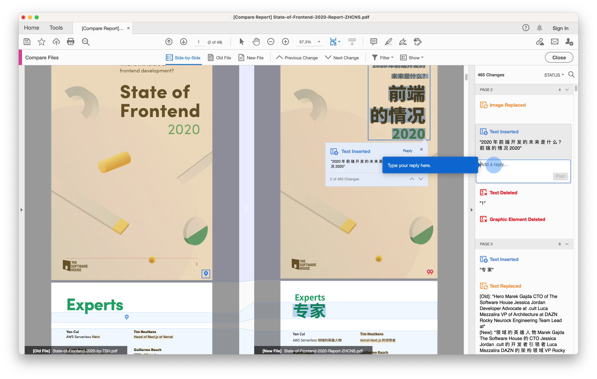

# PDF 校对帮助

因为大多数的年度调查年度报告都是以 PDF 的格式呈现，便于阅读也便于比较，因此要校对年度报告的译文并没有那么方便。在这里，我们将使用 Adobe Acrobat 为例子，简析怎么进行 PDF 校对。

首先，我们需要下载安装 Adobe Acrobat，打开他的用户界面，如下图：

你会注意到上方由一条工具栏，点击 `See All Tools`，就会显示所有 Adobe Acrobat 拥有的工具。我们将用户界面拉到下面，在 `Share & Review` 分区你会看到 `Compare Files`
功能，点击这个按钮：

你将会看到应用程序打开了 Compare Files 功能板，有两个需要输入的文件，一个是旧文件（原文），一个是新文件（译文），选择文件后点击 `Compare` 即可：

在一段时间的处理后，你就会看到两份 PDF 并排排列，内容不同的地方均有高亮，如图：

我们点击这些高亮即可评论：

并且如果可以的话，也可以在 GitHub 相应的 Issue 或 PR 中评论需要修改、完善地方的地址：）
